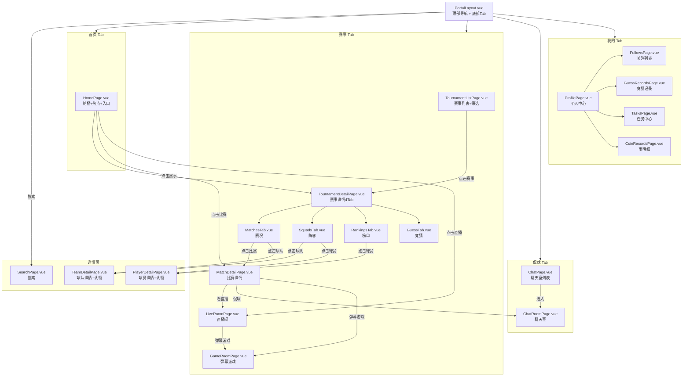

# 赛事中心系统架构设计 — 赛小蜂足球赛事综合门户

> **文档版本**：v1.0
> **编写人**：高见远（Gao）· 架构师
> **所属团队**：赛小蜂软件开发团队
> **编写日期**：2026-06-26
> **设计依据**：`docs/tournament-center-prd.md` v1.0
> **技术栈**：Vue 3.4 + Vite 5.4 + Element Plus 2.7 + 微信云开发（CloudBase）

---

## 1. 实现方案概述

### 1.1 技术选型

| 层级 | 技术 | 说明 |
|------|------|------|
| 前端框架 | Vue 3.4（Composition API + `<script setup>`） | 与现有项目一致 |
| 构建工具 | Vite 5.4 | 与现有项目一致 |
| UI 组件库 | Element Plus 2.7 | 与现有项目一致，利用其响应式栅格系统 |
| 路由 | Vue Router 4（Hash 模式） | 与现有项目一致，部署在 `/admin/` 子目录 |
| 状态管理 | Pinia | 赛事中心独立 store，管理用户态、竞猜态、直播态 |
| 样式方案 | CSS 变量 + SCSS + 媒体查询 | 复用现有全局变量，移动优先响应式 |
| 后端 | 微信云开发（CloudBase） | 零 SDK 模式，`fetch()` → `webLoginApi` HTTP API |
| 实时通信 | 云开发实时数据推送（watch）| 聊天室、弹幕游戏、直播比分实时同步 |
| 图表 | ECharts 5（按需引入） | 榜单雷达图、数据对比、资产趋势 |
| 动画 | CSS Animation + GSAP（可选） | 进球特效、礼花动画、弹幕滚动 |

**核心原则**
- **不侵入现有后台**：赛事中心门户使用独立布局组件 `PortalLayout.vue`，与管理后台 `LayoutView.vue` 完全隔离。
- **移动优先**：所有页面先写移动端布局，再通过媒体查询扩展 PC 端多栏。
- **组件复用**：业务卡片（赛事卡、比赛卡、球队卡、球员卡）双端共用，仅布局结构不同。
- **渐进式开发**：P0 搭框架 → P1 加互动 → P2 加社交 → P3 加后台，每层可独立上线。

### 1.2 整体架构图

```mermaid
graph TB
    subgraph 用户端["用户端（浏览器）"]
        UI[赛事中心门户 SPA]
        ADMIN[超管后台 SPA]
    end

    subgraph CloudBase["微信云开发 cloud1-7g8ckb3c7815a011"]
        subgraph Hosting["CloudBase Hosting"]
            H1["/admin/ → web-admin-vue 构建"]
        end

        subgraph HTTP["HTTP API 服务"]
            WLA[webLoginApi<br/>统一入口]
        end

        subgraph Functions["云函数"]
            F1[tc-portal<br/>门户数据聚合]
            F2[tc-guess<br/>竞猜系统]
            F3[tc-live<br/>直播管理]
            F4[tc-social<br/>社交互动]
            F5[tc-game<br/>弹幕游戏]
            F6[tc-coin<br/>双币体系]
            F7[tc-admin<br/>超管后台]
            F8[tc-claim<br/>数据认领]
        end

        subgraph DB["云数据库"]
            D1[tournaments 赛事]
            D2[teams 球队]
            D3[players 球员]
            D4[matches 比赛]
            D5[tc_banners 轮播图]
            D6[tc_categories 分类]
            D7[tc_guesses 竞猜]
            D8[tc_guess_pools 奖池]
            D9[tc_live_rooms 直播间]
            D10[tc_chat_rooms 聊天室]
            D11[tc_chat_messages 聊天消息]
            D12[tc_comments 评论]
            D13[tc_game_rooms 游戏房间]
            D14[tc_user_coins 用户币]
            D15[tc_coin_transactions 币流水]
            D16[tc_follows 关注]
            D17[tc_likes 点赞]
            D18[tc_claims 认领]
            D19[tc_media_articles 自媒体]
            D20[tc_tasks 任务]
            D21[tc_titles 头衔]
        end

        subgraph Storage["云存储"]
            S1[赛事封面/队徽/球员头像]
            S2[直播封面/集锦视频]
            S3[自媒体图文图片]
            S4[用户头像]
        end
    end

    subgraph External["外部服务"]
        EXT1[saixiaofeng.com<br/>品牌官网]
        EXT2[短信服务]
        EXT3[视频直播流]
    end

    UI -->|fetch HTTP| WLA
    ADMIN -->|fetch HTTP| WLA
    WLA --> F1 & F2 & F3 & F4 & F5 & F6 & F7 & F8
    F1 --> D1 & D2 & D3 & D4 & D5 & D6
    F2 --> D7 & D8 & D14 & D15
    F3 --> D9 & D4
    F4 --> D10 & D11 & D12 & D16 & D17 & D21
    F5 --> D13 & D14 & D15
    F6 --> D14 & D15 & D20
    F7 --> D1 & D2 & D3 & D5 & D6 & D9 & D8 & D14
    F8 --> D18 & D2 & D3
    F1 & F3 & F4 --> S1 & S2 & S3
    F8 <-->|数据认领同步| EXT1
    F6 -->|验证码| EXT2
    F3 -->|拉流| EXT3
```



---

## 2. 页面结构与路由设计

### 2.1 路由表（完整路由配置）

> 赛事中心门户路由统一前缀 `/portal/`，使用独立布局 `PortalLayout.vue`，与管理后台 `LayoutView.vue` 隔离。超管后台路由保持现有 `/tournament-center-admin` 并扩展子路由。

```javascript
// web-admin-vue/src/router/index.js（新增路由片段）

// ============ 赛事中心门户（公众访问，无需登录） ============
{
  path: '/portal',
  component: () => import('../views/portal/layout/PortalLayout.vue'),
  meta: { requiresAuth: false, title: '赛事中心' },
  children: [
    // 首页（P0-02~05）
    {
      path: '',
      name: 'PortalHome',
      component: () => import('../views/portal/home/HomePage.vue'),
      meta: { requiresAuth: false, title: '首页', tab: 'home' }
    },
    // 赛事列表页（P0-06）
    {
      path: 'tournaments',
      name: 'PortalTournaments',
      component: () => import('../views/portal/tournament/TournamentListPage.vue'),
      meta: { requiresAuth: false, title: '赛事', tab: 'tournament' }
    },
    // 赛事详情页（P0-07）— 4 Tab
    {
      path: 'tournaments/:id',
      name: 'PortalTournamentDetail',
      component: () => import('../views/portal/tournament/TournamentDetailPage.vue'),
      meta: { requiresAuth: false, title: '赛事详情' },
      children: [
        // 赛况 Tab（P0-09）
        {
          path: 'matches',
          name: 'PortalTournamentMatches',
          component: () => import('../views/portal/tournament/detail/MatchesTab.vue'),
          meta: { requiresAuth: false, title: '赛况' }
        },
        // 阵容 Tab（P0-11）
        {
          path: 'squads',
          name: 'PortalTournamentSquads',
          component: () => import('../views/portal/tournament/detail/SquadsTab.vue'),
          meta: { requiresAuth: false, title: '阵容' }
        },
        // 榜单 Tab（P1-12~15）
        {
          path: 'rankings',
          name: 'PortalTournamentRankings',
          component: () => import('../views/portal/tournament/detail/RankingsTab.vue'),
          meta: { requiresAuth: false, title: '榜单' }
        },
        // 竞猜 Tab（P1-05~09）
        {
          path: 'guess',
          name: 'PortalTournamentGuess',
          component: () => import('../views/portal/tournament/detail/GuessTab.vue'),
          meta: { requiresAuth: false, title: '竞猜' }
        }
      ]
    },
    // 比赛详情页（P0-10）
    {
      path: 'matches/:matchId',
      name: 'PortalMatchDetail',
      component: () => import('../views/portal/match/MatchDetailPage.vue'),
      meta: { requiresAuth: false, title: '比赛详情' }
    },
    // 直播间（P1-03）
    {
      path: 'live/:matchId',
      name: 'PortalLiveRoom',
      component: () => import('../views/portal/live/LiveRoomPage.vue'),
      meta: { requiresAuth: false, title: '直播间' }
    },
    // 侃球页（P2-01）
    {
      path: 'chat',
      name: 'PortalChat',
      component: () => import('../views/portal/chat/ChatPage.vue'),
      meta: { requiresAuth: false, title: '侃球', tab: 'chat' }
    },
    // 聊天室详情
    {
      path: 'chat/:roomId',
      name: 'PortalChatRoom',
      component: () => import('../views/portal/chat/ChatRoomPage.vue'),
      meta: { requiresAuth: false, title: '聊天室' }
    },
    // 弹幕小游戏（P1-16）
    {
      path: 'game/:matchId',
      name: 'PortalGameRoom',
      component: () => import('../views/portal/game/GameRoomPage.vue'),
      meta: { requiresAuth: false, title: '弹幕游戏' }
    },
    // 个人中心（P0-12）
    {
      path: 'profile',
      name: 'PortalProfile',
      component: () => import('../views/portal/profile/ProfilePage.vue'),
      meta: { requiresAuth: false, title: '我的', tab: 'profile' }
    },
    // 个人中心 — 关注列表（P2-09）
    {
      path: 'profile/follows',
      name: 'PortalProfileFollows',
      component: () => import('../views/portal/profile/FollowsPage.vue'),
      meta: { requiresAuth: false, title: '我的关注' }
    },
    // 个人中心 — 竞猜记录（P2-10）
    {
      path: 'profile/guess-records',
      name: 'PortalProfileGuessRecords',
      component: () => import('../views/portal/profile/GuessRecordsPage.vue'),
      meta: { requiresAuth: false, title: '竞猜记录' }
    },
    // 个人中心 — 竞猜币任务中心（P1-10）
    {
      path: 'profile/tasks',
      name: 'PortalProfileTasks',
      component: () => import('../views/portal/profile/TasksPage.vue'),
      meta: { requiresAuth: false, title: '任务中心' }
    },
    // 个人中心 — 蜂蜜币明细（P1-11）
    {
      path: 'profile/coin-records',
      name: 'PortalProfileCoinRecords',
      component: () => import('../views/portal/profile/CoinRecordsPage.vue'),
      meta: { requiresAuth: false, title: '币明细' }
    },
    // 球队详情页（认领入口）
    {
      path: 'teams/:teamId',
      name: 'PortalTeamDetail',
      component: () => import('../views/portal/team/TeamDetailPage.vue'),
      meta: { requiresAuth: false, title: '球队详情' }
    },
    // 球员详情页（认领入口）
    {
      path: 'players/:playerId',
      name: 'PortalPlayerDetail',
      component: () => import('../views/portal/player/PlayerDetailPage.vue'),
      meta: { requiresAuth: false, title: '球员详情' }
    },
    // 搜索页
    {
      path: 'search',
      name: 'PortalSearch',
      component: () => import('../views/portal/search/SearchPage.vue'),
      meta: { requiresAuth: false, title: '搜索' }
    }
  ]
},
// 旧版赛事中心路由重定向到新门户
{
  path: '/tournament-center',
  redirect: '/portal'
},

// ============ 超管后台扩展（需登录，复用 LayoutView.vue） ============
// 在现有 /tournament-center-admin 下扩展子路由
{
  path: '/tournament-center-admin',
  component: () => import('../views/layout/LayoutView.vue'),
  meta: { requiresAuth: true, title: '赛事中心管理' },
  children: [
    { path: '', name: 'TcAdminDashboard', component: () => import('../views/tournament-center/admin/AdminDashboard.vue') },
    // 数据创建（P3-01）
    { path: 'data-create', name: 'TcAdminDataCreate', component: () => import('../views/tournament-center/admin/DataCreatePage.vue') },
    // 认领审核（P3-02）
    { path: 'claim-review', name: 'TcAdminClaimReview', component: () => import('../views/tournament-center/admin/ClaimReviewPage.vue') },
    // 运营内容（P3-03）
    { path: 'content', name: 'TcAdminContent', component: () => import('../views/tournament-center/admin/ContentManagePage.vue') },
    // 赛事分类管理（P3-04）
    { path: 'categories', name: 'TcAdminCategories', component: () => import('../views/tournament-center/admin/CategoryManagePage.vue') },
    // 直播调度（P3-05）
    { path: 'live-schedule', name: 'TcAdminLiveSchedule', component: () => import('../views/tournament-center/admin/LiveSchedulePage.vue') },
    // 竞猜配置（P3-06）
    { path: 'guess-config', name: 'TcAdminGuessConfig', component: () => import('../views/tournament-center/admin/GuessConfigPage.vue') },
    // 双币规则（P3-07）
    { path: 'coin-rules', name: 'TcAdminCoinRules', component: () => import('../views/tournament-center/admin/CoinRulesPage.vue') },
    // 自媒体管理（P3-08）
    { path: 'media', name: 'TcAdminMedia', component: () => import('../views/tournament-center/admin/MediaManagePage.vue') }
  ]
}
```

### 2.2 页面目录结构

```
web-admin-vue/src/
├── views/
│   ├── portal/                          # ★ 赛事中心门户（新增）
│   │   ├── layout/
│   │   │   ├── PortalLayout.vue         # 门户布局（顶部导航 + 底部Tab + router-view）
│   │   │   ├── TopNavBar.vue            # PC端顶部导航栏
│   │   │   └── BottomTabBar.vue         # 移动端底部Tab导航
│   │   ├── home/
│   │   │   ├── HomePage.vue             # 首页
│   │   │   └── components/
│   │   │       ├── BannerCarousel.vue   # 轮播图
│   │   │       ├── QuickEntryGrid.vue   # 快速入口宫格
│   │   │       ├── HotMatches.vue       # 热点赛事
│   │   │       ├── LiveSchedule.vue     # 今日直播（PC右栏）
│   │   │       └── MiniRanking.vue      # 迷你人气榜（PC右栏）
│   │   ├── tournament/
│   │   │   ├── TournamentListPage.vue   # 赛事列表页
│   │   │   ├── TournamentDetailPage.vue # 赛事详情页（4 Tab 容器）
│   │   │   ├── components/
│   │   │   │   ├── TournamentHeader.vue # 赛事顶部信息
│   │   │   │   ├── CategoryFilter.vue   # 分类筛选
│   │   │   │   └── TournamentCard.vue   # 赛事卡片
│   │   │   └── detail/
│   │   │       ├── MatchesTab.vue       # 赛况Tab
│   │   │       ├── SquadsTab.vue        # 阵容Tab
│   │   │       ├── RankingsTab.vue      # 榜单Tab
│   │   │       └── GuessTab.vue         # 竞猜Tab
│   │   ├── match/
│   │   │   ├── MatchDetailPage.vue      # 比赛详情页
│   │   │   └── components/
│   │   │       ├── ScoreBoard.vue       # 比分板
│   │   │       ├── MatchTimeline.vue    # 比赛进程时间轴
│   │   │       ├── MatchSquad.vue       # 阵容简表
│   │   │       └── DataCompare.vue      # 数据对比
│   │   ├── live/
│   │   │   ├── LiveRoomPage.vue         # 直播间
│   │   │   └── components/
│   │   │       ├── VideoPlayer.vue      # 视频播放器
│   │   │       ├── DanmakuLayer.vue     # 弹幕层
│   │   │       ├── LiveChatPanel.vue    # 直播聊天面板
│   │   │       └── GiftPanel.vue        # 礼物面板
│   │   ├── chat/
│   │   │   ├── ChatPage.vue             # 侃球页（聊天室列表）
│   │   │   ├── ChatRoomPage.vue         # 聊天室详情
│   │   │   └── components/
│   │   │       ├── ChatMessage.vue      # 消息气泡
│   │   │       ├── ChatInput.vue        # 输入栏
│   │   │       └── TopicList.vue        # 热门话题列表
│   │   ├── game/
│   │   │   ├── GameRoomPage.vue         # 弹幕游戏房间
│   │   │   └── components/
│   │   │       ├── GameField.vue        # 球场Canvas
│   │   │       ├── GameBall.vue         # 足球动画
│   │   │       ├── PushButton.vue       # 点赞推送按钮
│   │   │       └── ContributeRank.vue   # 贡献榜
│   │   ├── profile/
│   │   │   ├── ProfilePage.vue          # 个人中心
│   │   │   ├── FollowsPage.vue          # 关注列表
│   │   │   ├── GuessRecordsPage.vue     # 竞猜记录
│   │   │   ├── TasksPage.vue            # 任务中心
│   │   │   ├── CoinRecordsPage.vue      # 币明细
│   │   │   └── components/
│   │   │       ├── AssetCard.vue        # 资产卡
│   │   │       └── TaskItem.vue         # 任务项
│   │   ├── team/
│   │   │   ├── TeamDetailPage.vue       # 球队详情
│   │   │   └── components/
│   │   │       ├── TeamInfoCard.vue     # 球队信息卡
│   │   │       └── SquadList.vue        # 阵容列表
│   │   ├── player/
│   │   │   ├── PlayerDetailPage.vue     # 球员详情
│   │   │   └── components/
│   │   │       └── PlayerStatChart.vue  # 球员数据雷达图
│   │   ├── search/
│   │   │   └── SearchPage.vue           # 搜索页
│   │   └── components/                  # 门户公共组件
│   │       ├── ResponsiveContainer.vue  # 响应式容器
│   │       ├── StatusBadge.vue          # 状态标签
│   │       ├── LiveDot.vue             # 直播脉冲点
│   │       ├── ClaimButton.vue         # 认领按钮
│   │       ├── FollowButton.vue        # 关注按钮
│   │       ├── LikeButton.vue          # 点赞按钮
│   │       ├── UserAvatar.vue          # 用户头像
│   │       ├── TitleBadge.vue          # 头衔徽章
│   │       ├── EmptyState.vue          # 空状态
│   │       └── LoginDialog.vue         # 登录弹窗
│   ├── tournament-center/               # 超管后台（重构现有）
│   │   ├── admin/
│   │   │   ├── AdminDashboard.vue      # 后台首页看板
│   │   │   ├── DataCreatePage.vue      # 数据创建
│   │   │   ├── ClaimReviewPage.vue     # 认领审核
│   │   │   ├── ContentManagePage.vue   # 运营内容
│   │   │   ├── CategoryManagePage.vue  # 分类管理
│   │   │   ├── LiveSchedulePage.vue    # 直播调度
│   │   │   ├── GuessConfigPage.vue     # 竞猜配置
│   │   │   ├── CoinRulesPage.vue       # 双币规则
│   │   │   └── MediaManagePage.vue     # 自媒体管理
│   │   └── TournamentCenterAdmin.vue   # （保留，重构为 Dashboard 入口）
│   └── ...（现有其他页面不变）
├── stores/                              # ★ Pinia Store（新增）
│   ├── portal.js                        # 门户全局状态
│   ├── user.js                          # 门户用户状态
│   └── live.js                          # 直播状态
├── composables/                         # ★ 组合式函数（新增）
│   ├── useResponsive.js                 # 响应式断点检测
│   ├── usePortalApi.js                  # 门户API调用
│   ├── useLivePolling.js                # 直播轮询
│   ├── useWatch.js                      # 实时数据监听
│   └── useAuth.js                       # 门户登录态
└── ...（现有其他目录不变）
```

### 2.3 页面层级关系图



---

## 3. 组件拆分方案

### 3.1 公共组件

| 组件名 | 路径 | 功能 | 复用场景 |
|--------|------|------|----------|
| `PortalLayout` | `portal/layout/PortalLayout.vue` | 门户主布局：PC顶部导航 / 移动底部Tab + router-view | 所有门户页面 |
| `TopNavBar` | `portal/layout/TopNavBar.vue` | PC端顶部导航栏（Logo + 菜单 + 搜索 + 登录） | PC端布局 |
| `BottomTabBar` | `portal/layout/BottomTabBar.vue` | 移动端底部4Tab导航 | 移动端布局 |
| `ResponsiveContainer` | `portal/components/ResponsiveContainer.vue` | 响应式容器：移动单列 / PC三栏 | 首页、赛事列表 |
| `StatusBadge` | `portal/components/StatusBadge.vue` | 比赛状态标签（未开始/进行中/已结束） | 赛况、比赛卡 |
| `LiveDot` | `portal/components/LiveDot.vue` | 直播红色脉冲点动画 | 热点赛事、赛况 |
| `ClaimButton` | `portal/components/ClaimButton.vue` | 数据认领按钮（含未认领/已认证状态） | 球队详情、球员详情 |
| `FollowButton` | `portal/components/FollowButton.vue` | 关注/取关按钮 | 球队卡、球员卡、榜单 |
| `LikeButton` | `portal/components/LikeButton.vue` | 点赞按钮（每日限制） | 人气榜 |
| `UserAvatar` | `portal/components/UserAvatar.vue` | 用户头像（含头衔徽章） | 聊天室、评论 |
| `TitleBadge` | `portal/components/TitleBadge.vue` | 头衔徽章 | 聊天室、评论 |
| `EmptyState` | `portal/components/EmptyState.vue` | 空状态占位 | 列表页通用 |
| `LoginDialog` | `portal/components/LoginDialog.vue` | 登录弹窗（手机号验证码） | 需登录操作触发 |
| `TournamentCard` | `portal/tournament/components/TournamentCard.vue` | 赛事卡片（封面+名称+状态+队数） | 首页、赛事列表 |
| `MatchCard` | `portal/match/components/MatchCard.vue` | 比赛卡片（双方+比分+状态+操作） | 赛况、热点、竞猜 |
| `TeamLogo` | `portal/components/TeamLogo.vue` | 球队Logo（含默认图兜底） | 全局 |
| `PlayerAvatar` | `portal/components/PlayerAvatar.vue` | 球员头像（含默认图兜底） | 全局 |

### 3.2 页面组件

| 页面 | 组件 | 核心职责 | 关键交互 |
|------|------|----------|----------|
| 首页 | `HomePage` | 轮播图+快速入口+热点赛事+PC右栏 | 轮播切换、分类跳转、直播进入 |
| 赛事列表 | `TournamentListPage` | 分类筛选+状态筛选+排序+卡片网格 | 分类切换、筛选联动 |
| 赛事详情 | `TournamentDetailPage` | 赛事头部+4Tab容器 | Tab切换、路由参数同步 |
| 赛况Tab | `MatchesTab` | 轮次选择+状态分段+比赛列表 | 轮次切换、直播/回放入口 |
| 阵容Tab | `SquadsTab` | 球队选择+阵容列表+PC阵型图 | 球队切换、球员弹层 |
| 榜单Tab | `RankingsTab` | 4榜切换+TOP3特殊样式+维度切换 | 榜单切换、关注/点赞 |
| 竞猜Tab | `GuessTab` | 可竞猜比赛列表+玩法选择+确认弹层 | 玩法选择、竞猜币扣减 |
| 比赛详情 | `MatchDetailPage` | 比分板+时间轴+阵容+数据对比 | 实时轮询、竞猜入口 |
| 直播间 | `LiveRoomPage` | 视频播放器+弹幕+聊天+礼物+游戏入口 | 弹幕发送、送礼、游戏 |
| 侃球页 | `ChatPage` | 聊天室列表+游戏入口+热门话题 | 进入聊天室 |
| 聊天室 | `ChatRoomPage` | 消息流+输入栏+表情+礼物 | 实时收发、@用户 |
| 弹幕游戏 | `GameRoomPage` | 球场Canvas+阵营选择+推送按钮 | 点赞推送、送礼推送 |
| 个人中心 | `ProfilePage` | 用户卡+资产+功能宫格 | 菜单跳转 |
| 球队详情 | `TeamDetailPage` | 球队信息+阵容+认领入口 | 认领申请 |
| 球员详情 | `PlayerDetailPage` | 球员数据+雷达图+认领入口 | 认领申请 |

### 3.3 组件依赖关系

```mermaid
graph TD
    PortalLayout --> TopNavBar
    PortalLayout --> BottomTabBar
    PortalLayout --> ResponsiveContainer

    HomePage --> BannerCarousel
    HomePage --> QuickEntryGrid
    HomePage --> HotMatches
    HomePage --> LiveSchedule
    HomePage --> MiniRanking
    HomePage --> TournamentCard
    HomePage --> MatchCard

    HotMatches --> MatchCard
    HotMatches --> LiveDot
    HotMatches --> StatusBadge

    TournamentListPage --> CategoryFilter
    TournamentListPage --> TournamentCard

    TournamentDetailPage --> TournamentHeader
    TournamentDetailPage --> MatchesTab
    TournamentDetailPage --> SquadsTab
    TournamentDetailPage --> RankingsTab
    TournamentDetailPage --> GuessTab

    MatchesTab --> MatchCard
    MatchCard --> TeamLogo
    MatchCard --> StatusBadge
    MatchCard --> LiveDot

    SquadsTab --> SquadList
    SquadList --> PlayerAvatar
    SquadList --> ClaimButton

    RankingsTab --> FollowButton
    RankingsTab --> LikeButton

    GuessTab --> MatchCard
    GuessTab --> LoginDialog

    MatchDetailPage --> ScoreBoard
    MatchDetailPage --> MatchTimeline
    MatchDetailPage --> MatchSquad
    MatchDetailPage --> DataCompare
    ScoreBoard --> TeamLogo

    LiveRoomPage --> VideoPlayer
    LiveRoomPage --> DanmakuLayer
    LiveRoomPage --> LiveChatPanel
    LiveRoomPage --> GiftPanel
    LiveChatPanel --> ChatMessage
    LiveChatPanel --> ChatInput
    LiveChatPanel --> UserAvatar
    LiveChatPanel --> TitleBadge

    GameRoomPage --> GameField
    GameRoomPage --> GameBall
    GameRoomPage --> PushButton
    GameRoomPage --> ContributeRank

    ProfilePage --> AssetCard
    ProfilePage --> LoginDialog

    TeamDetailPage --> TeamInfoCard
    TeamDetailPage --> SquadList
    TeamDetailPage --> ClaimButton
    TeamDetailPage --> FollowButton

    PlayerDetailPage --> PlayerStatChart
    PlayerDetailPage --> ClaimButton
    PlayerDetailPage --> FollowButton
```



---

## 4. 数据结构设计

### 4.1 云数据库集合（新增/改造）

> 命名规范：赛事中心新增集合统一前缀 `tc_`，与现有 `tournaments`、`teams`、`players`、`matches` 集合通过 ID 关联。

| 集合名 | 说明 | 类型 | PRD 对应 |
|--------|------|------|----------|
| `tc_banners` | 首页轮播图 | 新增 | P0-02, P3-03 |
| `tc_categories` | 赛事分类（7类） | 新增 | P0-08, P3-04 |
| `tc_guesses` | 竞猜记录 | 新增 | P1-05~09 |
| `tc_guess_pools` | 竞猜奖池 | 新增 | P1-08 |
| `tc_live_rooms` | 直播间 | 新增 | P1-01~04, P3-05 |
| `tc_chat_rooms` | 聊天室 | 新增 | P2-01 |
| `tc_chat_messages` | 聊天消息 | 新增 | P2-01 |
| `tc_comments` | 评论 | 新增 | P2-02 |
| `tc_game_rooms` | 弹幕游戏房间 | 新增 | P1-16 |
| `tc_game_actions` | 游戏推送动作 | 新增 | P1-16 |
| `tc_user_coins` | 用户双币余额 | 新增 | P1-10, P1-11 |
| `tc_coin_transactions` | 币流水 | 新增 | P1-10, P1-11 |
| `tc_tasks` | 任务定义 | 新增 | P1-10 |
| `tc_task_records` | 任务完成记录 | 新增 | P1-10 |
| `tc_follows` | 关注关系 | 新增 | P2-04 |
| `tc_likes` | 点赞记录 | 新增 | P1-14, P1-15 |
| `tc_claims` | 认领申请 | 新增 | P0-14, P3-02 |
| `tc_media_articles` | 自媒体图文 | 新增 | P2-06, P2-07 |
| `tc_titles` | 头衔定义 | 新增 | P2-03 |
| `tc_user_titles` | 用户头衔授予 | 新增 | P2-03 |
| `tournaments` | 赛事（现有） | 改造 | P0-06~08 |
| `teams` | 球队（现有） | 改造 | P0-11 |
| `players` | 球员（现有） | 改造 | P0-11 |
| `matches` | 比赛（现有） | 改造 | P0-09, P0-10 |

### 4.2 数据模型定义（JSON Schema）

#### 4.2.1 tc_banners（轮播图）

```json
{
  "_id": "String (自动生成)",
  "title": "String (标题)",
  "imageUrl": "String (图片URL，云存储路径)",
  "linkType": "String (跳转类型: tournament | match | live | external | none)",
  "linkTarget": "String (跳转目标ID或URL)",
  "sort": "Number (排序，升序)",
  "isActive": "Boolean (是否启用)",
  "position": "String (展示位置: home_top | home_banner)",
  "startTime": "Date (生效时间)",
  "endTime": "Date (失效时间)",
  "createdAt": "Date (创建时间)",
  "updatedAt": "Date (更新时间)"
}
```

#### 4.2.2 tc_categories（赛事分类）

```json
{
  "_id": "String (自动生成)",
  "name": "String (分类名称，如：黄冠联赛)",
  "code": "String (分类编码，如：huangguan)",
  "icon": "String (图标URL)",
  "sort": "Number (排序)",
  "isActive": "Boolean (是否启用)",
  "description": "String (分类描述)",
  "createdAt": "Date (创建时间)"
}
```

> 预置 7 类：黄冠联赛(huangguan)、超勇足球杯(chaoyong)、地市联赛(dishi)、青少年赛事(qingnian)、业余联赛(yeyu)、系列赛(xilie)、其他赛事(qita)

#### 4.2.3 tc_guesses（竞猜记录）

```json
{
  "_id": "String (自动生成)",
  "userId": "String (用户ID)",
  "matchId": "String (比赛ID)",
  "tournamentId": "String (赛事ID)",
  "playType": "String (玩法: handicap | win_draw_loss | home_win_loss)",
  "prediction": "String (预测结果: win | draw | loss)",
  "handicap": "Number (让球数，仅handicap玩法，如-1表示主队让1球)",
  "betAmount": "Number (押注竞猜币数量)",
  "status": "String (状态: pending | won | lost | cancelled)",
  "settleResult": "String (结算结果描述)",
  "payoutAmount": "Number (瓜分所得，0表示未猜中)",
  "createdAt": "Date (竞猜时间)",
  "settledAt": "Date (结算时间)"
}
```

#### 4.2.4 tc_guess_pools（竞猜奖池）

```json
{
  "_id": "String (自动生成)",
  "matchId": "String (比赛ID)",
  "tournamentId": "String (赛事ID)",
  "playType": "String (玩法: handicap | win_draw_loss | home_win_loss)",
  "totalPool": "Number (奖池总额，竞猜币)",
  "totalParticipants": "Number (参与人数)",
  "winnersCount": "Number (猜中人数)",
  "perWinnerAmount": "Number (每人瓜分金额)",
  "status": "String (状态: open | settled | rolled)",
  "initialPool": "Number (初始奖池，平台注入)",
  "settledAt": "Date (结算时间)",
  "createdAt": "Date (创建时间)"
}
```

#### 4.2.5 tc_live_rooms（直播间）

```json
{
  "_id": "String (自动生成)",
  "matchId": "String (比赛ID)",
  "tournamentId": "String (赛事ID)",
  "title": "String (直播标题)",
  "coverImage": "String (封面图URL)",
  "streamUrl": "String (视频流URL，RTMP/HLS)",
  "streamType": "String (流类型: video | graphic)",
  "status": "String (直播状态: scheduled | live | ended | cancelled)",
  "onlineCount": "Number (在线人数)",
  "totalViewers": "Number (累计观看人数)",
  "scheduledStart": "Date (预计开始时间)",
  "actualStart": "Date (实际开始时间)",
  "actualEnd": "Date (实际结束时间)",
  "replayUrl": "String (回放视频URL)",
  "highlightsUrl": "String (集锦视频URL)",
  "reservationCount": "Number (预约人数)",
  "createdAt": "Date (创建时间)",
  "updatedAt": "Date (更新时间)"
}
```

#### 4.2.6 tc_chat_rooms（聊天室）

```json
{
  "_id": "String (自动生成)",
  "tournamentId": "String (赛事ID，可为空表示全局聊天室)",
  "matchId": "String (比赛ID，可为空)",
  "name": "String (聊天室名称)",
  "type": "String (类型: tournament | match | global)",
  "onlineCount": "Number (在线人数)",
  "totalMessages": "Number (总消息数)",
  "lastMessage": "String (最新消息预览)",
  "lastMessageAt": "Date (最新消息时间)",
  "isActive": "Boolean (是否活跃)",
  "createdAt": "Date (创建时间)"
}
```

#### 4.2.7 tc_chat_messages（聊天消息）

```json
{
  "_id": "String (自动生成)",
  "roomId": "String (聊天室ID)",
  "userId": "String (发送者用户ID)",
  "userName": "String (发送者昵称)",
  "userAvatar": "String (发送者头像URL)",
  "titleId": "String (头衔ID，可为空)",
  "content": "String (消息内容)",
  "msgType": "String (消息类型: text | image | emoji | gift | system)",
  "imageUrl": "String (图片URL，msgType=image时)",
  "giftId": "String (礼物ID，msgType=gift时)",
  "giftCount": "Number (礼物数量)",
  "isDeleted": "Boolean (是否删除)",
  "createdAt": "Date (发送时间)"
}
```

#### 4.2.8 tc_game_rooms（弹幕游戏房间）

```json
{
  "_id": "String (自动生成)",
  "matchId": "String (比赛ID)",
  "tournamentId": "String (赛事ID)",
  "homeTeamId": "String (主队ID)",
  "awayTeamId": "String (客队ID)",
  "ballPosition": "Number (足球位置，-100到100，0为中圈，正值偏向客队球门)",
  "homeScore": "Number (主队游戏得分)",
  "awayScore": "Number (客队游戏得分)",
  "status": "String (状态: waiting | playing | ended)",
  "homePushCount": "Number (主队总推力)",
  "awayPushCount": "Number (客队总推力)",
  "homeParticipants": "Number (主队参与人数)",
  "awayParticipants": "Number (客队参与人数)",
  "winnerSide": "String (获胜方: home | away | draw)",
  "prizePool": "Number (奖池，竞猜币)",
  "startedAt": "Date (开始时间)",
  "endedAt": "Date (结束时间)",
  "createdAt": "Date (创建时间)"
}
```

#### 4.2.9 tc_game_actions（游戏推送动作）

```json
{
  "_id": "String (自动生成)",
  "gameRoomId": "String (游戏房间ID)",
  "userId": "String (用户ID)",
  "side": "String (阵营: home | away)",
  "actionType": "String (动作类型: like | gift)",
  "pushPower": "Number (推力值)",
  "giftId": "String (礼物ID，actionType=gift时)",
  "giftCost": "Number (蜂蜜币消耗，actionType=gift时)",
  "createdAt": "Date (动作时间)"
}
```

#### 4.2.10 tc_user_coins（用户双币余额）

```json
{
  "_id": "String (自动生成)",
  "userId": "String (用户ID)",
  "guessCoin": "Number (竞猜币余额)",
  "honeyCoin": "Number (蜂蜜币余额)",
  "totalEarnedGuess": "Number (累计获得竞猜币)",
  "totalEarnedHoney": "Number (累计获得蜂蜜币)",
  "totalSpentGuess": "Number (累计消耗竞猜币)",
  "totalSpentHoney": "Number (累计消耗蜂蜜币)",
  "lastSignDate": "Date (最后签到日期)",
  "signStreak": "Number (连续签到天数)",
  "createdAt": "Date (创建时间)",
  "updatedAt": "Date (更新时间)"
}
```

#### 4.2.11 tc_coin_transactions（币流水）

```json
{
  "_id": "String (自动生成)",
  "userId": "String (用户ID)",
  "coinType": "String (币类型: guess | honey)",
  "amount": "Number (金额，正数获得，负数消耗)",
  "balance": "Number (交易后余额)",
  "reason": "String (变动原因: sign | live_watch | task | guess_bet | guess_win | gift_send | game_push | admin_grant | activity)",
  "reasonId": "String (关联ID，如任务ID、竞猜ID)",
  "description": "String (描述)",
  "createdAt": "Date (交易时间)"
}
```

#### 4.2.12 tc_tasks（任务定义）

```json
{
  "_id": "String (自动生成)",
  "name": "String (任务名称)",
  "code": "String (任务编码)",
  "type": "String (任务类型: daily | weekly | once | achievement)",
  "coinType": "String (奖励币类型: guess | honey)",
  "rewardAmount": "Number (奖励数量)",
  "targetCount": "Number (目标次数)",
  "condition": "String (完成条件描述)",
  "icon": "String (图标)",
  "sort": "Number (排序)",
  "isActive": "Boolean (是否启用)",
  "createdAt": "Date (创建时间)"
}
```

#### 4.2.13 tc_task_records（任务完成记录）

```json
{
  "_id": "String (自动生成)",
  "userId": "String (用户ID)",
  "taskId": "String (任务ID)",
  "taskCode": "String (任务编码)",
  "progress": "Number (当前进度)",
  "targetCount": "Number (目标次数)",
  "isCompleted": "Boolean (是否完成)",
  "isRewarded": "Boolean (是否已领奖)",
  "rewardedAt": "Date (领奖时间)",
  "dateKey": "String (日期标识，如2026-06-26，用于每日任务)",
  "createdAt": "Date (创建时间)"
}
```

#### 4.2.14 tc_follows（关注关系）

```json
{
  "_id": "String (自动生成)",
  "userId": "String (关注者用户ID)",
  "targetType": "String (关注对象类型: team | player)",
  "targetId": "String (关注对象ID)",
  "createdAt": "Date (关注时间)"
}
```

#### 4.2.15 tc_likes（点赞记录）

```json
{
  "_id": "String (自动生成)",
  "userId": "String (点赞者用户ID)",
  "targetType": "String (对象类型: team | player | article | comment)",
  "targetId": "String (对象ID)",
  "dateKey": "String (日期标识，防重复点赞)",
  "createdAt": "Date (点赞时间)"
}
```

#### 4.2.16 tc_claims（认领申请）

```json
{
  "_id": "String (自动生成)",
  "userId": "String (申请者用户ID)",
  "phone": "String (申请者手机号)",
  "targetType": "String (认领对象类型: team | player)",
  "targetId": "String (认领对象ID)",
  "targetName": "String (认领对象名称)",
  "identityProof": "String (身份说明，如球衣号、职务)",
  "evidenceImages": "Array<String> (证明材料图片URL数组)",
  "status": "String (状态: pending | approved | rejected)",
  "reviewNote": "String (审核备注)",
  "reviewerId": "String (审核人ID)",
  "reviewedAt": "Date (审核时间)",
  "createdAt": "Date (申请时间)"
}
```

#### 4.2.17 tc_media_articles（自媒体图文）

```json
{
  "_id": "String (自动生成)",
  "authorId": "String (作者用户ID)",
  "authorName": "String (作者昵称)",
  "authorAvatar": "String (作者头像)",
  "matchId": "String (关联比赛ID，可为空)",
  "tournamentId": "String (关联赛事ID，可为空)",
  "title": "String (标题)",
  "content": "String (内容，富文本)",
  "coverImage": "String (封面图URL)",
  "images": "Array<String> (图片URL数组)",
  "type": "String (类型: live_blog | report | highlight)",
  "status": "String (状态: draft | pending | published | rejected)",
  "viewCount": "Number (阅读数)",
  "likeCount": "Number (点赞数)",
  "commentCount": "Number (评论数)",
  "isRecommended": "Boolean (是否推荐到首页)",
  "publishedAt": "Date (发布时间)",
  "createdAt": "Date (创建时间)",
  "updatedAt": "Date (更新时间)"
}
```

#### 4.2.18 tc_titles（头衔定义）

```json
{
  "_id": "String (自动生成)",
  "name": "String (头衔名称，如：铁杆球迷)",
  "code": "String (头衔编码)",
  "level": "Number (等级，1-5)",
  "icon": "String (图标URL)",
  "color": "String (徽章颜色)",
  "condition": "String (获得条件描述)",
  "conditionType": "String (条件类型: follow_count | guess_count | live_duration | comment_count | admin_grant)",
  "conditionValue": "Number (条件阈值)",
  "isActive": "Boolean (是否启用)",
  "createdAt": "Date (创建时间)"
}
```

#### 4.2.19 tournaments（赛事 — 改造字段）

```json
{
  "_id": "String (现有)",
  "name": "String (现有)",
  "logo": "String (现有)",
  "categoryId": "String (★新增，关联tc_categories)",
  "categoryCode": "String (★新增，分类编码冗余字段)",
  "season": "String (现有)",
  "status": "String (现有，扩展: registering | ongoing | completed)",
  "teamCount": "Number (现有)",
  "organizer": "String (现有)",
  "format": "String (★新增，赛制说明)",
  "coverImage": "String (★新增，赛事封面banner)",
  "description": "String (★新增，赛事简介)",
  "progress": "String (★新增，赛程进度: group_stage | knockout | final)",
  "isHot": "Boolean (★新增，是否热点赛事)",
  "sortOrder": "Number (★新增，排序权重)",
  "viewCount": "Number (★新增，浏览量)",
  // ... 现有其他字段保留
}
```

#### 4.2.20 matches（比赛 — 改造字段）

```json
{
  "_id": "String (现有)",
  "tournamentId": "String (现有)",
  "homeTeamId": "String (现有)",
  "awayTeamId": "String (现有)",
  "homeTeamName": "String (现有)",
  "awayTeamName": "String (现有)",
  "homeTeamLogo": "String (现有)",
  "awayTeamLogo": "String (现有)",
  "homeScore": "Number (现有)",
  "awayScore": "Number (现有)",
  "status": "String (★扩展: not_started | live | ended)",
  "matchTime": "Date (现有，开赛时间)",
  "venue": "String (★新增，比赛场地)",
  "round": "String (★新增，轮次: 第1轮 / 淘汰赛)",
  "roundIndex": "Number (★新增，轮次序号)",
  "currentMinute": "Number (★新增，当前比赛分钟数，live状态)",
  "events": "Array (★新增，比赛事件: [{type, minute, team, player, description}])",
  "lineup": "Object (★新增，首发阵容: {home: [], away: []})",
  "stats": "Object (★新增，数据统计: {possession, shots, corners, fouls, ...})",
  "isHot": "Boolean (★新增，是否焦点战)",
  // ... 现有其他字段保留
}
```

### 4.3 集合关系图

```mermaid
erDiagram
    tc_categories ||--o{ tournaments : "分类包含赛事"
    tournaments ||--o{ matches : "赛事包含比赛"
    tournaments ||--o{ teams : "赛事包含球队"
    teams ||--o{ players : "球队包含球员"
    matches }o--|| teams : "主队"
    matches }o--|| teams : "客队"

    matches ||--o{ tc_guesses : "比赛关联竞猜"
    matches ||--o{ tc_guess_pools : "比赛关联奖池"
    matches ||--o|| tc_live_rooms : "比赛关联直播间"
    matches ||--o|| tc_game_rooms : "比赛关联游戏房间"

    tc_user_coins ||--o{ tc_coin_transactions : "用户币流水"
    tc_user_coins }o--|| tc_tasks : "任务奖励"
    tc_tasks ||--o{ tc_task_records : "任务完成记录"

    tc_chat_rooms ||--o{ tc_chat_messages : "聊天室消息"
    tc_chat_rooms }o--o| matches : "比赛聊天室"
    tc_chat_rooms }o--o| tournaments : "赛事聊天室"

    tc_follows }o--|| teams : "关注球队"
    tc_follows }o--|| players : "关注球员"
    tc_likes }o--o| teams : "点赞球队"
    tc_likes }o--o| players : "点赞球员"

    tc_claims }o--o| teams : "认领球队"
    tc_claims }o--o| players : "认领球员"

    tc_media_articles }o--o| matches : "自媒体关联比赛"
    tc_titles ||--o{ tc_user_titles : "头衔授予"
```

---

## 5. 云函数接口设计

### 5.1 新增云函数列表

| 云函数名 | 说明 | PRD 对应 |
|----------|------|----------|
| `tc-portal` | 门户数据聚合（首页、列表、详情） | P0-02~11 |
| `tc-guess` | 竞猜系统（提交、结算、记录） | P1-05~09 |
| `tc-live` | 直播管理（预约、观看、回放） | P1-01~04 |
| `tc-social` | 社交互动（聊天、评论、关注、点赞） | P2-01~05 |
| `tc-game` | 弹幕小游戏（推送、同步、结算） | P1-16 |
| `tc-coin` | 双币体系（余额、流水、签到、任务） | P1-10, P1-11 |
| `tc-admin` | 超管后台（数据创建、审核、配置） | P3-01~08 |
| `tc-claim` | 数据认领（申请、审核、同步） | P0-14, P3-02 |
| `tc-ranking` | 榜单系统（战绩榜、人气榜） | P1-12~15 |

### 5.2 接口定义（入参/出参）

#### 5.2.1 tc-portal（门户数据聚合）

| action | 入参 | 出参 | 说明 |
|--------|------|------|------|
| `getHomeData` | `{}` | `{ banners, hotMatches, categories, liveSchedule, miniRanking }` | 首页聚合数据 |
| `getTournamentList` | `{ categoryCode, status, sortBy, page, pageSize }` | `{ list, total, page }` | 赛事列表（分页） |
| `getTournamentDetail` | `{ tournamentId }` | `{ tournament, teams, matchCount }` | 赛事详情基础信息 |
| `getMatchesByTournament` | `{ tournamentId, round, status, page, pageSize }` | `{ list, total, rounds }` | 赛事下比赛列表 |
| `getMatchDetail` | `{ matchId }` | `{ match, events, lineup, stats }` | 比赛详情 |
| `getSquadByTeam` | `{ teamId, tournamentId }` | `{ team, players }` | 球队阵容 |
| `search` | `{ keyword, type, page, pageSize }` | `{ list, total }` | 搜索（赛事/球队/球员） |

#### 5.2.2 tc-guess（竞猜系统）

| action | 入参 | 出参 | 说明 |
|--------|------|------|------|
| `getGuessList` | `{ tournamentId, matchId, status }` | `{ list }` | 可竞猜比赛列表 |
| `submitGuess` | `{ matchId, playType, prediction, handicap, betAmount }` | `{ success, guessId, balance }` | 提交竞猜 |
| `getMyGuesses` | `{ userId, status, page, pageSize }` | `{ list, total }` | 我的竞猜记录 |
| `settleGuess` | `{ matchId }` | `{ settled, winners, prizePerPerson }` | 结算竞猜（内部调用） |
| `getPoolInfo` | `{ matchId, playType }` | `{ pool, participants, winners }` | 奖池信息 |
| `cancelGuess` | `{ guessId }` | `{ success, refundAmount }` | 撤回竞猜（待确认） |

**`submitGuess` 出参示例**：
```json
{
  "success": true,
  "guessId": "guess_xxx",
  "balance": { "guessCoin": 850, "honeyCoin": 100 },
  "message": "竞猜成功，等待开奖"
}
```

#### 5.2.3 tc-live（直播管理）

| action | 入参 | 出参 | 说明 |
|--------|------|------|------|
| `getLiveList` | `{ status, tournamentId, date }` | `{ list }` | 直播列表 |
| `getLiveRoom` | `{ matchId }` | `{ room, match, isLive, streamUrl }` | 直播间详情 |
| `reserveLive` | `{ matchId }` | `{ success, reservationCount }` | 预约直播 |
| `endLive` | `{ matchId, replayUrl, highlightsUrl }` | `{ success }` | 结束直播（超管） |
| `getLiveSchedule` | `{ date }` | `{ list }` | 今日直播时间轴 |

#### 5.2.4 tc-social（社交互动）

| action | 入参 | 出参 | 说明 |
|--------|------|------|------|
| `getChatRooms` | `{ tournamentId, matchId, type }` | `{ list }` | 聊天室列表 |
| `getChatMessages` | `{ roomId, lastMsgId, limit }` | `{ list, hasMore }` | 聊天消息（分页） |
| `sendMessage` | `{ roomId, content, msgType, imageUrl, giftId }` | `{ success, message }` | 发送消息 |
| `getComments` | `{ targetType, targetId, page }` | `{ list, total }` | 评论列表 |
| `addComment` | `{ targetType, targetId, content }` | `{ success, comment }` | 发表评论 |
| `follow` | `{ targetType, targetId }` | `{ success, isFollowing }` | 关注/取关 |
| `getFollowList` | `{ userId, targetType }` | `{ list }` | 关注列表 |
| `like` | `{ targetType, targetId }` | `{ success, isLiked, likeCount }` | 点赞（每日限1次） |
| `getUserTitle` | `{ userId }` | `{ title, level }` | 获取用户头衔 |

#### 5.2.5 tc-game（弹幕小游戏）

| action | 入参 | 出参 | 说明 |
|--------|------|------|------|
| `getGameRoom` | `{ matchId }` | `{ room, ballPosition, scores }` | 游戏房间状态 |
| `joinGame` | `{ matchId, side }` | `{ success, gameRoomId }` | 选择阵营加入 |
| `push` | `{ gameRoomId, actionType, giftId }` | `{ success, ballPosition, pushPower }` | 推送（点赞/送礼） |
| `getGameResult` | `{ matchId }` | `{ winnerSide, prizePool, myShare }` | 游戏结果 |
| `getContributeRank` | `{ gameRoomId, side }` | `{ list }` | 贡献榜 |

> 实时同步：`ballPosition` 通过云开发实时数据推送（watch `tc_game_rooms` 文档变更）同步到所有客户端，不依赖轮询。

#### 5.2.6 tc-coin（双币体系）

| action | 入参 | 出参 | 说明 |
|--------|------|------|------|
| `getBalance` | `{ userId }` | `{ guessCoin, honeyCoin }` | 双币余额 |
| `getTransactions` | `{ userId, coinType, page, pageSize }` | `{ list, total }` | 币流水 |
| `sign` | `{ userId }` | `{ success, reward, streak, balance }` | 每日签到 |
| `getTasks` | `{ userId, type }` | `{ list }` | 任务列表（含进度） |
| `claimTaskReward` | `{ taskId }` | `{ success, reward, balance }` | 领取任务奖励 |
| `watchLiveReward` | `{ userId, matchId, duration }` | `{ success, reward, balance }` | 看直播时长奖励 |

#### 5.2.7 tc-admin（超管后台）

| action | 入参 | 出参 | 说明 |
|--------|------|------|------|
| `createTournament` | `{ ...tournamentData }` | `{ success, id }` | 创建赛事（未认领） |
| `createTeam` | `{ ...teamData }` | `{ success, id }` | 创建球队（未认领） |
| `createPlayer` | `{ ...playerData }` | `{ success, id }` | 创建球员（未认领） |
| `batchImport` | `{ type, data }` | `{ success, count, errors }` | 批量导入 |
| `getClaimList` | `{ status, page }` | `{ list, total }` | 认领申请列表 |
| `reviewClaim` | `{ claimId, action, note }` | `{ success }` | 审核认领（通过/驳回） |
| `saveBanner` | `{ bannerData }` | `{ success, id }` | 保存轮播图 |
| `getBanners` | `{}` | `{ list }` | 轮播图列表 |
| `saveCategory` | `{ categoryData }` | `{ success, id }` | 保存分类 |
| `getCategories` | `{}` | `{ list }` | 分类列表 |
| `setLiveStatus` | `{ matchId, status, streamUrl }` | `{ success }` | 直播调度 |
| `saveGuessConfig` | `{ matchId, config }` | `{ success }` | 竞猜配置 |
| `saveCoinRules` | `{ rules }` | `{ success }` | 双币规则配置 |
| `getDashboard` | `{ dateRange }` | `{ dau, guessRate, claimRate, ... }` | 数据看板 |

#### 5.2.8 tc-claim（数据认领）

| action | 入参 | 出参 | 说明 |
|--------|------|------|------|
| `submitClaim` | `{ targetType, targetId, identityProof, evidenceImages }` | `{ success, claimId }` | 提交认领申请 |
| `getMyClaims` | `{ userId }` | `{ list }` | 我的认领列表 |
| `getClaimStatus` | `{ targetType, targetId }` | `{ status, claimId }` | 认领状态查询 |
| `syncToOfficial` | `{ claimId }` | `{ success, officialUrl }` | 认领通过后同步到官网 |

#### 5.2.9 tc-ranking（榜单系统）

| action | 入参 | 出参 | 说明 |
|--------|------|------|------|
| `getTeamRanking` | `{ tournamentId, sortBy }` | `{ list }` | 球队战绩榜 |
| `getPlayerRanking` | `{ tournamentId, metric }` | `{ list }` | 球员数据榜 |
| `getTeamPopularity` | `{ tournamentId }` | `{ list }` | 球队人气榜 |
| `getPlayerPopularity` | `{ tournamentId }` | `{ list }` | 球员人气榜 |
| `updatePopularity` | `{}` | `{ success }` | 人气值聚合（定时任务） |

### 5.3 路由映射（CLOUD_FUNCTION_MAP）

> 在 `web-admin-vue/src/utils/cloud.js` 的 `CLOUD_FUNCTION_MAP` 中新增以下映射：

```javascript
// 赛事中心云函数 → 调用方式映射
// 'relay' = 通过 webLoginApi callFunction 中转
// 'direct' = 直接 HTTP 调用云函数端点
const TC_FUNCTION_MAP = {
  'tc-portal':  'relay',
  'tc-guess':   'relay',
  'tc-live':    'relay',
  'tc-social':  'relay',
  'tc-game':    'relay',
  'tc-coin':    'relay',
  'tc-admin':   'relay',
  'tc-claim':   'relay',
  'tc-ranking': 'relay',
}
```

> 所有赛事中心云函数统一通过 `relay` 方式调用（经 `webLoginApi` 的 `callFunction` action 中转），原因：这些云函数没有独立 HTTP 触发端点，需通过统一入口转发。

**门户 API 调用封装**（`composables/usePortalApi.js`）：

```javascript
import { callFunction } from '../utils/cloud'

// 统一云函数调用封装
export async function callPortalApi(functionName, action, data = {}) {
  const result = await callFunction(functionName, { action, ...data })
  return result
}

// 示例：获取首页数据
export function getHomeData() {
  return callPortalApi('tc-portal', 'getHomeData')
}

// 示例：提交竞猜
export function submitGuess(params) {
  return callPortalApi('tc-guess', 'submitGuess', params)
}
```

---

## 6. 任务列表

> 每个任务包含：任务ID、描述、涉及文件路径、依赖任务ID、预估复杂度(低/中/高)。
> 实现顺序遵循依赖关系，同优先级内按 ID 顺序执行。

### 6.1 P0 任务（核心门户框架）

| 任务ID | 描述 | 涉及文件路径 | 依赖 | 复杂度 |
|--------|------|-------------|------|--------|
| P0-T01 | 搭建门户布局框架：PortalLayout + TopNavBar + BottomTabBar + 响应式断点 composable | `views/portal/layout/PortalLayout.vue`<br>`views/portal/layout/TopNavBar.vue`<br>`views/portal/layout/BottomTabBar.vue`<br>`composables/useResponsive.js`<br>`router/index.js` | - | 高 |
| P0-T02 | 门户路由配置：新增 `/portal` 全部路由，旧路由重定向 | `router/index.js` | P0-T01 | 中 |
| P0-T03 | 门户全局样式与 CSS 变量扩展（响应式断点、移动端优先） | `assets/portal.css`<br>`assets/global.css` | P0-T01 | 低 |
| P0-T04 | 门户 Pinia Store 与 API 封装 | `stores/portal.js`<br>`stores/user.js`<br>`composables/usePortalApi.js`<br>`composables/useAuth.js` | P0-T01 | 中 |
| P0-T05 | tc-portal 云函数：首页数据聚合接口 | `cloudfunctions/tc-portal/index.js` | P0-T04 | 高 |
| P0-T06 | tc_categories 集合初始化与分类预置数据 | `cloudfunctions/tc-portal/index.js`<br>数据库初始化脚本 | P0-T05 | 低 |
| P0-T07 | 首页：轮播图组件 + 快速入口宫格 | `views/portal/home/HomePage.vue`<br>`views/portal/home/components/BannerCarousel.vue`<br>`views/portal/home/components/QuickEntryGrid.vue` | P0-T01, P0-T05 | 中 |
| P0-T08 | 首页：热点赛事组件（3状态Tab + 比赛卡片 + 直播脉冲点） | `views/portal/home/components/HotMatches.vue`<br>`views/portal/match/components/MatchCard.vue`<br>`views/portal/components/LiveDot.vue`<br>`views/portal/components/StatusBadge.vue`<br>`views/portal/components/TeamLogo.vue` | P0-T07 | 高 |
| P0-T09 | 首页：斗战足球 banner + PC端右栏（今日直播 + 迷你人气榜） | `views/portal/home/components/LiveSchedule.vue`<br>`views/portal/home/components/MiniRanking.vue`<br>`views/portal/components/ResponsiveContainer.vue` | P0-T08 | 中 |
| P0-T10 | 赛事列表页：分类筛选 + 状态筛选 + 排序 + 卡片网格 | `views/portal/tournament/TournamentListPage.vue`<br>`views/portal/tournament/components/CategoryFilter.vue`<br>`views/portal/tournament/components/TournamentCard.vue` | P0-T05 | 中 |
| P0-T11 | tournaments 集合改造：新增 categoryId、coverImage、isHot 等字段 | `cloudfunctions/tc-portal/index.js`<br>数据库迁移脚本 | P0-T05 | 中 |
| P0-T12 | 赛事详情页框架：赛事头部 + 4Tab 容器 + 路由联动 | `views/portal/tournament/TournamentDetailPage.vue`<br>`views/portal/tournament/components/TournamentHeader.vue` | P0-T10 | 中 |
| P0-T13 | 赛况 Tab：轮次选择 + 状态分段 + 比赛列表（3种状态卡片） | `views/portal/tournament/detail/MatchesTab.vue` | P0-T12, P0-T08 | 高 |
| P0-T14 | matches 集合改造：扩展 status、round、events、lineup、stats 字段 | `cloudfunctions/tc-portal/index.js`<br>数据库迁移脚本 | P0-T11 | 中 |
| P0-T15 | 比赛详情页：比分板 + 时间轴 + 阵容简表 + 数据对比 | `views/portal/match/MatchDetailPage.vue`<br>`views/portal/match/components/ScoreBoard.vue`<br>`views/portal/match/components/MatchTimeline.vue`<br>`views/portal/match/components/MatchSquad.vue`<br>`views/portal/match/components/DataCompare.vue` | P0-T13 | 高 |
| P0-T16 | 阵容 Tab：球队选择器 + 球队信息卡 + 阵容列表（按位置分组）+ PC阵型图 | `views/portal/tournament/detail/SquadsTab.vue`<br>`views/portal/team/components/TeamInfoCard.vue`<br>`views/portal/team/components/SquadList.vue`<br>`views/portal/components/PlayerAvatar.vue` | P0-T12 | 高 |
| P0-T17 | 个人中心基础页：用户卡 + 功能宫格（未登录态登录引导） | `views/portal/profile/ProfilePage.vue`<br>`views/portal/components/LoginDialog.vue`<br>`views/portal/profile/components/AssetCard.vue` | P0-T01 | 中 |
| P0-T18 | 门户公共组件库：EmptyState、UserAvatar、FollowButton、ClaimButton 等 | `views/portal/components/*.vue` | P0-T01 | 中 |
| P0-T19 | 侃球 Tab 占位页 + 榜单/竞猜 Tab 占位页（4Tab完整可切换） | `views/portal/chat/ChatPage.vue`<br>`views/portal/tournament/detail/RankingsTab.vue`<br>`views/portal/tournament/detail/GuessTab.vue` | P0-T12 | 低 |
| P0-T20 | 数据认领基础流程：tc_claims 集合 + tc-claim 云函数 + 认领按钮组件 | `cloudfunctions/tc-claim/index.js`<br>`views/portal/components/ClaimButton.vue`<br>`views/portal/team/TeamDetailPage.vue`<br>`views/portal/player/PlayerDetailPage.vue` | P0-T18 | 高 |

**P0 实现顺序**：
```
P0-T01 → P0-T02 → P0-T03 → P0-T04 → P0-T05 → P0-T06
                                                     ↓
P0-T07 → P0-T08 → P0-T09（首页线）
P0-T10 → P0-T11 → P0-T12 → P0-T13 → P0-T15（赛事线）
                                  → P0-T16（阵容线）
                                  → P0-T19（占位线）
P0-T17 → P0-T18 → P0-T20（个人/认领线）
```

### 6.2 P1 任务（互动功能）

| 任务ID | 描述 | 涉及文件路径 | 依赖 | 复杂度 |
|--------|------|-------------|------|--------|
| P1-T01 | tc-coin 云函数 + tc_user_coins/tc_coin_transactions 集合 | `cloudfunctions/tc-coin/index.js` | P0-T04 | 高 |
| P1-T02 | 双币余额展示 + 每日签到 | `views/portal/profile/components/AssetCard.vue`<br>`views/portal/profile/TasksPage.vue`<br>`cloudfunctions/tc-coin/index.js` | P1-T01, P0-T17 | 中 |
| P1-T03 | 任务系统：任务定义 + 完成记录 + 领取奖励 | `cloudfunctions/tc-coin/index.js`<br>`views/portal/profile/TasksPage.vue`<br>`views/portal/profile/components/TaskItem.vue` | P1-T01 | 高 |
| P1-T04 | tc-live 云函数 + tc_live_rooms 集合 | `cloudfunctions/tc-live/index.js` | P0-T04 | 高 |
| P1-T05 | 直播列表 + 预约功能 | `views/portal/home/components/LiveSchedule.vue`<br>`cloudfunctions/tc-live/index.js` | P1-T04 | 中 |
| P1-T06 | 直播间：视频播放器 + 弹幕层 + 聊天面板 + 礼物面板 | `views/portal/live/LiveRoomPage.vue`<br>`views/portal/live/components/VideoPlayer.vue`<br>`views/portal/live/components/DanmakuLayer.vue`<br>`views/portal/live/components/LiveChatPanel.vue`<br>`views/portal/live/components/GiftPanel.vue` | P1-T04, P0-T15 | 高 |
| P1-T07 | 集锦与全场回放：已结束比赛回看入口 + 播放 | `views/portal/live/LiveRoomPage.vue`<br>`cloudfunctions/tc-live/index.js` | P1-T06 | 中 |
| P1-T08 | tc-guess 云函数 + tc_guesses/tc_guess_pools 集合 | `cloudfunctions/tc-guess/index.js` | P1-T01 | 高 |
| P1-T09 | 竞猜 Tab：可竞猜比赛列表 + 玩法选择（让球/胜平负/主队胜负） | `views/portal/tournament/detail/GuessTab.vue`<br>`cloudfunctions/tc-guess/index.js` | P1-T08, P0-T19 | 高 |
| P1-T10 | 竞猜提交：确认弹层 + 扣减竞猜币 + 成功动画 | `views/portal/tournament/detail/GuessTab.vue`<br>`cloudfunctions/tc-guess/index.js` | P1-T09 | 中 |
| P1-T11 | 竞猜结算：比赛结束后自动结算 + 瓜分奖池 + 结果页 | `cloudfunctions/tc-guess/index.js`<br>`views/portal/profile/GuessRecordsPage.vue` | P1-T10 | 高 |
| P1-T12 | tc-ranking 云函数 + 球队战绩榜 + 球员数据榜 | `cloudfunctions/tc-ranking/index.js`<br>`views/portal/tournament/detail/RankingsTab.vue` | P0-T11, P0-T14 | 高 |
| P1-T13 | 球队人气榜 + 球员人气榜（依赖关注+点赞数据聚合） | `cloudfunctions/tc-ranking/index.js`<br>`views/portal/tournament/detail/RankingsTab.vue` | P1-T12, P2-T05 | 中 |
| P1-T14 | tc-game 云函数 + tc_game_rooms 集合 + 实时推送 | `cloudfunctions/tc-game/index.js`<br>`composables/useWatch.js` | P1-T04 | 高 |
| P1-T15 | 弹幕游戏：球场Canvas + 足球动画 + 阵营选择 + 推送按钮 | `views/portal/game/GameRoomPage.vue`<br>`views/portal/game/components/GameField.vue`<br>`views/portal/game/components/GameBall.vue`<br>`views/portal/game/components/PushButton.vue` | P1-T14 | 高 |
| P1-T16 | 弹幕游戏：贡献榜 + 进球动画 + 结算瓜分 | `views/portal/game/components/ContributeRank.vue`<br>`views/portal/game/GameRoomPage.vue`<br>`cloudfunctions/tc-game/index.js` | P1-T15 | 中 |
| P1-T17 | 蜂蜜币消耗：送礼面板 + 弹幕游戏送礼推力 + 余额联动 | `views/portal/live/components/GiftPanel.vue`<br>`cloudfunctions/tc-game/index.js`<br>`cloudfunctions/tc-coin/index.js` | P1-T06, P1-T15 | 中 |

**P1 实现顺序**：
```
P1-T01 → P1-T02 → P1-T03（双币线）
P1-T04 → P1-T05 → P1-T06 → P1-T07（直播线）
P1-T08 → P1-T09 → P1-T10 → P1-T11（竞猜线）
P1-T12 → P1-T13（榜单线，P1-T13依赖P2-T05）
P1-T14 → P1-T15 → P1-T16 → P1-T17（游戏线）
```

### 6.3 P2 任务（社交与运营）

| 任务ID | 描述 | 涉及文件路径 | 依赖 | 复杂度 |
|--------|------|-------------|------|--------|
| P2-T01 | tc-social 云函数 + tc_chat_rooms/tc_chat_messages 集合 | `cloudfunctions/tc-social/index.js` | P0-T04 | 高 |
| P2-T02 | 聊天室列表页 + 聊天室详情（消息流 + 输入栏 + 实时监听） | `views/portal/chat/ChatPage.vue`<br>`views/portal/chat/ChatRoomPage.vue`<br>`views/portal/chat/components/ChatMessage.vue`<br>`views/portal/chat/components/ChatInput.vue` | P2-T01 | 高 |
| P2-T03 | 评论区组件 + tc_comments 集合 | `cloudfunctions/tc-social/index.js`<br>`views/portal/chat/components/TopicList.vue` | P2-T01 | 中 |
| P2-T04 | tc_follows 集合 + 关注/取关功能 | `cloudfunctions/tc-social/index.js`<br>`views/portal/components/FollowButton.vue` | P2-T01 | 中 |
| P2-T05 | 点赞功能 + tc_likes 集合 + 人气数据聚合 | `cloudfunctions/tc-social/index.js`<br>`views/portal/components/LikeButton.vue` | P2-T04 | 中 |
| P2-T06 | 头衔体系：tc_titles/tc_user_titles 集合 + 头衔徽章组件 | `cloudfunctions/tc-social/index.js`<br>`views/portal/components/TitleBadge.vue` | P2-T01 | 中 |
| P2-T07 | 个人中心 — 关注列表页 | `views/portal/profile/FollowsPage.vue` | P2-T04, P0-T17 | 低 |
| P2-T08 | 个人中心 — 竞猜记录页 | `views/portal/profile/GuessRecordsPage.vue` | P1-T11, P0-T17 | 低 |
| P2-T09 | 个人中心 — 蜂蜜币明细页 | `views/portal/profile/CoinRecordsPage.vue` | P1-T01, P0-T17 | 低 |
| P2-T10 | 自媒体图文直播：tc_media_articles 集合 + 发布功能 | `cloudfunctions/tc-social/index.js`<br>`views/portal/live/LiveRoomPage.vue` | P1-T06 | 高 |
| P2-T11 | 自媒体内容分发：首页推荐 + 图文详情 | `views/portal/home/HomePage.vue`<br>`cloudfunctions/tc-portal/index.js` | P2-T10 | 中 |
| P2-T12 | 搜索页：赛事/球队/球员模糊搜索 | `views/portal/search/SearchPage.vue`<br>`cloudfunctions/tc-portal/index.js` | P0-T05 | 中 |
| P2-T13 | 球队详情页完整版：信息卡 + 阵容 + 战绩 + 认领入口 | `views/portal/team/TeamDetailPage.vue`<br>`views/portal/team/components/TeamInfoCard.vue` | P0-T20, P0-T16 | 中 |
| P2-T14 | 球员详情页完整版：数据卡 + 雷达图 + 认领入口 | `views/portal/player/PlayerDetailPage.vue`<br>`views/portal/player/components/PlayerStatChart.vue` | P0-T20 | 中 |

**P2 实现顺序**：
```
P2-T01 → P2-T02（聊天室线）
P2-T01 → P2-T03（评论线）
P2-T01 → P2-T04 → P2-T05（关注+点赞线）
P2-T01 → P2-T06（头衔线）
P2-T04 → P2-T07 / P2-T08 → P2-T09（个人中心线）
P1-T06 → P2-T10 → P2-T11（自媒体线）
P0-T05 → P2-T12（搜索线）
P0-T20 → P2-T13 / P2-T14（详情页线）
```

### 6.4 P3 任务（后台管理增强）

| 任务ID | 描述 | 涉及文件路径 | 依赖 | 复杂度 |
|--------|------|-------------|------|--------|
| P3-T01 | 超管后台 Dashboard 看板（DAU、竞猜率、认领率） | `views/tournament-center/admin/AdminDashboard.vue`<br>`cloudfunctions/tc-admin/index.js` | P0-T01 | 中 |
| P3-T02 | 数据创建页：赛事/球队/球员批量创建（未认领数据） | `views/tournament-center/admin/DataCreatePage.vue`<br>`cloudfunctions/tc-admin/index.js` | P0-T11 | 高 |
| P3-T03 | 认领审核页：申请列表 + 证明材料查看 + 通过/驳回 | `views/tournament-center/admin/ClaimReviewPage.vue`<br>`cloudfunctions/tc-admin/index.js`<br>`cloudfunctions/tc-claim/index.js` | P0-T20 | 中 |
| P3-T04 | 运营内容管理：轮播图 + Banner CRUD | `views/tournament-center/admin/ContentManagePage.vue`<br>`cloudfunctions/tc-admin/index.js` | P0-T07 | 中 |
| P3-T05 | 赛事分类管理：7类分类 CRUD + 排序 | `views/tournament-center/admin/CategoryManagePage.vue`<br>`cloudfunctions/tc-admin/index.js` | P0-T06 | 低 |
| P3-T06 | 直播调度页：排期表 + 开播/关播控制 + 流地址配置 | `views/tournament-center/admin/LiveSchedulePage.vue`<br>`cloudfunctions/tc-admin/index.js` | P1-T04 | 中 |
| P3-T07 | 竞猜配置页：场次玩法 + 奖池初始值 + 瓜分规则 | `views/tournament-center/admin/GuessConfigPage.vue`<br>`cloudfunctions/tc-admin/index.js` | P1-T08 | 中 |
| P3-T08 | 双币规则配置页：获取/消耗规则 + 任务管理 | `views/tournament-center/admin/CoinRulesPage.vue`<br>`cloudfunctions/tc-admin/index.js` | P1-T03 | 中 |
| P3-T09 | 自媒体账号管理：创作者准入 + 内容审核 | `views/tournament-center/admin/MediaManagePage.vue`<br>`cloudfunctions/tc-admin/index.js` | P2-T10 | 中 |
| P3-T10 | 超管后台导航整合：adminNavItems 扩展子菜单 | `views/layout/LayoutView.vue`<br>`router/index.js` | P3-T01 | 低 |

**P3 实现顺序**：
```
P3-T01 → P3-T10（框架线）
P0-T11 → P3-T02（数据创建线）
P0-T20 → P3-T03（认领审核线）
P0-T07 → P3-T04 / P0-T06 → P3-T05（运营内容线）
P1-T04 → P3-T06 / P1-T08 → P3-T07 / P1-T03 → P3-T08（管理配置线）
P2-T10 → P3-T09（自媒体管理线）
```

---

## 7. 依赖包列表

### 7.1 新增依赖

| 包名 | 版本 | 用途 | 安装命令 |
|------|------|------|----------|
| `pinia` | ^2.1.7 | 状态管理 | `npm install pinia` |
| `echarts` | ^5.5.0 | 图表（榜单雷达图、数据对比、资产趋势） | `npm install echarts` |
| `dayjs` | ^1.11.10 | 日期处理（比赛时间、倒计时） | `npm install dayjs` |

### 7.2 现有依赖（无需新增）

| 包名 | 用途 |
|------|------|
| `vue` ^3.4 | 前端框架 |
| `vue-router` ^4 | 路由 |
| `element-plus` ^2.7 | UI 组件库 |
| `@element-plus/icons-vue` | 图标 |

### 7.3 main.js 注册

```javascript
// main.js 新增
import { createPinia } from 'pinia'
app.use(createPinia())

// ECharts 按需引入（在需要的组件中）
import * as echarts from 'echarts/core'
import { BarChart, RadarChart, LineChart } from 'echarts/charts'
import { GridComponent, TooltipComponent, LegendComponent } from 'echarts/components'
import { CanvasRenderer } from 'echarts/renderers'
echarts.use([BarChart, RadarChart, LineChart, GridComponent, TooltipComponent, LegendComponent, CanvasRenderer])
```

---

## 8. 共享知识（跨文件约定）

### 8.1 命名规范

| 类型 | 规范 | 示例 |
|------|------|------|
| 路由路径 | kebab-case，`/portal/` 前缀 | `/portal/tournaments/:id/matches` |
| 路由 name | PascalCase，`Portal` 前缀 | `PortalTournamentDetail` |
| 组件文件名 | PascalCase.vue | `TournamentCard.vue` |
| 组件 name | PascalCase | `TournamentCard` |
| CSS class | kebab-case，`portal-` 前缀避免冲突 | `.portal-header` `.match-card` |
| 云函数名 | kebab-case，`tc-` 前缀 | `tc-portal` `tc-guess` |
| 集合名 | snake_case，`tc_` 前缀 | `tc_guesses` `tc_live_rooms` |
| 字段名 | camelCase | `matchId` `createdAt` |
| Pinia store | camelCase 文件名 | `stores/portal.js` → `usePortalStore` |
| Composable | `use` 前缀 | `useResponsive` `usePortalApi` |
| 事件名 | kebab-case | `@tab-change` `@follow-updated` |

### 8.2 样式约定

**CSS 变量扩展**（`assets/portal.css`）：

```css
:root {
  /* 复用现有主色调 */
  --primary-green: #1B5E20;
  --primary-green-light: #2E7D32;
  --primary-green-lighter: #43A047;
  --primary-green-bg: #E8F5E9;

  /* 门户专用变量 */
  --portal-header-height: 56px;          /* 移动端顶部高度 */
  --portal-header-height-pc: 64px;       /* PC端顶部高度 */
  --portal-tabbar-height: 56px;          /* 底部Tab高度 */
  --portal-max-width: 1200px;            /* PC端最大宽度 */
  --portal-sidebar-width: 240px;         /* PC端左栏宽度 */
  --portal-rightbar-width: 280px;        /* PC端右栏宽度 */

  /* 状态色 */
  --status-live: #F56C6C;                /* 直播红 */
  --status-not-started: #909399;         /* 未开始灰 */
  --status-ended: #909399;               /* 已结束灰 */
  --status-ongoing: #67C23A;             /* 进行中绿 */
  --status-registering: #E6A23C;         /* 报名中橙 */

  /* 间距 */
  --portal-gap-sm: 8px;
  --portal-gap-md: 16px;
  --portal-gap-lg: 24px;

  /* 圆角 */
  --portal-radius: 8px;
  --portal-radius-sm: 4px;
  --portal-radius-lg: 12px;

  /* 响应式断点 */
  --bp-mobile: 768px;   /* < 768px 移动端 */
  --bp-tablet: 1024px;  /* 768-1024px 平板 */
  --bp-desktop: 1200px; /* > 1200px 桌面 */
}
```

**响应式断点策略**：

```css
/* 移动优先：默认移动端样式 */
.mobile-only { display: block; }
.pc-only { display: none; }

/* ≥768px PC端样式 */
@media (min-width: 768px) {
  .mobile-only { display: none; }
  .pc-only { display: block; }
}
```

**双端适配模式**：

```vue
<!-- 模式1：CSS控制显隐（推荐，同结构不同样式） -->
<template>
  <div class="hot-matches">
    <div class="match-list-mobile mobile-only"><!-- 移动单列 --></div>
    <div class="match-list-pc pc-only"><!-- PC多栏 --></div>
  </div>
</template>

<!-- 模式2：JS断点控制（结构差异大时） -->
<template>
  <div>
    <component :is="isMobile ? 'MobileLayout' : 'PcLayout'" />
  </div>
</template>
<script setup>
import { useResponsive } from '@/composables/useResponsive'
const { isMobile } = useResponsive()
</script>
```

### 8.3 数据流约定

**数据流向**：

```
用户操作 → Composable(usePortalApi) → callFunction(tc-xxx) → webLoginApi(HTTP) → 云函数 → 云数据库
                                                                                         ↓
用户界面 ← Pinia Store ← Composable ← 响应数据 ←────────────────────────────────────────┘
                                         ↑
                          实时推送(watch) ← 云数据库变更 ← 其它用户操作
```

**Pinia Store 职责**：
- `usePortalStore`：门户全局状态（当前Tab、分类列表、搜索关键词）
- `useUserStore`：用户状态（登录态、用户信息、双币余额、关注列表）
- `useLiveStore`：直播状态（当前直播间、弹幕列表、在线人数）

**API 调用规范**：
- 所有云函数调用统一通过 `composables/usePortalApi.js` 的 `callPortalApi(functionName, action, data)` 封装
- 列表查询统一支持分页：`{ page, pageSize }` → `{ list, total, page }`
- 时间字段统一使用 ISO 8601 格式（`new Date().toISOString()`）
- 金额字段统一为整数（竞猜币/蜂蜜币最小单位为1）

**实时数据监听规范**：

```javascript
// composables/useWatch.js
import { callFunction } from '../utils/cloud'

// 监听集合变更（通过云开发实时数据推送）
export function useWatch(collection, where, callback) {
  // 零SDK模式：通过轮询模拟实时（5秒间隔）
  // TODO: 后续接入云开发 WebSocket 实时推送
  let timer = null
  let lastId = null

  const start = async () => {
    const poll = async () => {
      const result = await callFunction('tc-portal', 'watchCollection', {
        collection, where, lastId
      })
      if (result.newDocs && result.newDocs.length > 0) {
        result.newDocs.forEach(callback)
        lastId = result.newDocs[result.newDocs.length - 1]._id
      }
    }
    await poll()
    timer = setInterval(poll, 5000)
  }

  const stop = () => { if (timer) clearInterval(timer) }

  onMounted(start)
  onUnmounted(stop)

  return { start, stop }
}
```

---

## 9. 待明确事项

> 以下事项需与产品经理（许清楚）和运营确认，不影响 P0 开发但影响 P1+ 实现。

| 编号 | 事项 | 影响范围 | 当前处理 |
|------|------|----------|----------|
| Q01 | 竞猜币是否可兑换实物奖品 | 竞猜系统设计、是否需要奖品商城 | P1 暂按纯虚拟币实现 |
| Q02 | 每场竞猜次数限制（1次 vs 多次） | 竞猜数据结构、奖池计算 | 暂按每人每种玩法1次 |
| Q03 | 奖池无人猜中处理方式 | 竞猜结算逻辑 | 暂按滚入下一期 |
| Q04 | 竞猜撤回机制 | 竞猜状态机、退款逻辑 | 暂不支持撤回 |
| Q05 | 新用户初始竞猜币赠送数额 | 用户注册流程 | 暂定赠送100竞猜币 |
| Q06 | 蜂蜜币最终命名 | 全局文案 | 暂用"蜂蜜币" |
| Q07 | 竞猜币兑换蜂蜜币比例 | 双币兑换逻辑 | 暂不支持兑换 |
| Q08 | 双币是否可提现/转账 | 双币体系设计 | 暂不可提现转账 |
| Q09 | 弹幕游戏结果与竞猜联动 | 游戏结算逻辑 | 暂完全独立 |
| Q10 | 弹幕游戏奖池来源 | 游戏奖励设计 | 暂平台发放 |
| Q11 | 点赞/送礼推力防刷机制 | 游戏推送接口 | 点赞3秒冷却，送礼无限制 |
| Q12 | 认领数量限制（手机号可认领上限） | 认领流程 | 暂定1球队+1球员 |
| Q13 | 认领冲突仲裁规则 | 认领审核流程 | 暂按先到先得+材料优先 |
| Q14 | 认领后数据同步到官网的时效 | 双站协同 | 暂准实时（审核通过后即时） |
| Q15 | 斗战直播来源（平台统一 vs 自媒体自播） | 直播架构 | 暂平台统一制作 |
| Q16 | 自媒体图文直播准入门槛 | 自媒体管理 | 暂超管审批制 |
| Q17 | 直播流量成本承担方 | 直播方案 | 待运营确认 |
| Q18 | 集锦与回放保留期限 | 存储成本 | 暂永久保留 |
| Q19 | 聊天室敏感词过滤/举报机制 | 社交系统 | 接入腾讯云内容安全 |
| Q20 | 头衔等级划分标准与权益 | 头衔体系 | 暂5级，按活跃度授予 |
| Q21 | 关注后比赛提醒方式（站内/短信/微信）| 关注系统 | 暂站内通知 |
| Q22 | 超管账号与公众用户是否分离 | 账号体系 | 暂分离（超管独立登录） |
| Q23 | 自媒体内容先审后发 vs 先发后审 | 内容运营 | 暂先发后审+举报 |
| Q24 | 双站账号互通（单点登录） | 双站协同 | 待技术评估 |
| Q25 | 竞猜合规性（博彩风险边界） | 竞猜系统 | 需法务确认，暂纯虚拟币 |
| Q26 | 未成年人保护与防沉迷 | 全局 | 暂不限制 |
| Q27 | 弹幕并发量预估与实时同步方案 | 直播架构 | 暂轮询5秒，后续升级WebSocket |
| Q28 | 实时数据推送方案（轮询 vs WebSocket） | 全局实时性 | P0/P1用轮询，P2+升级WebSocket |

---

> **文档结束**。本架构设计为开发实施方案依据，任务列表可直接用于 sprint 排期。待第 9 节待明确事项厘清后，将迭代为 v1.1。
