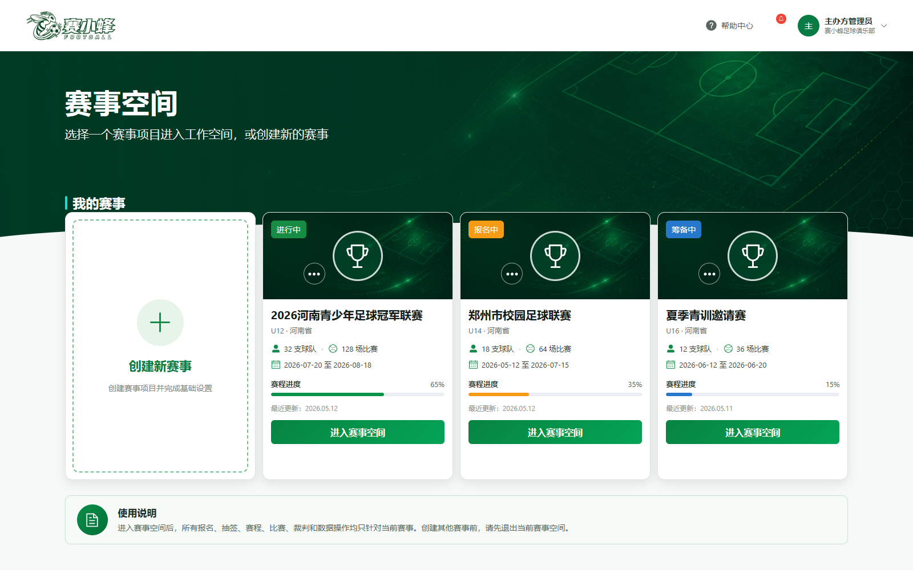
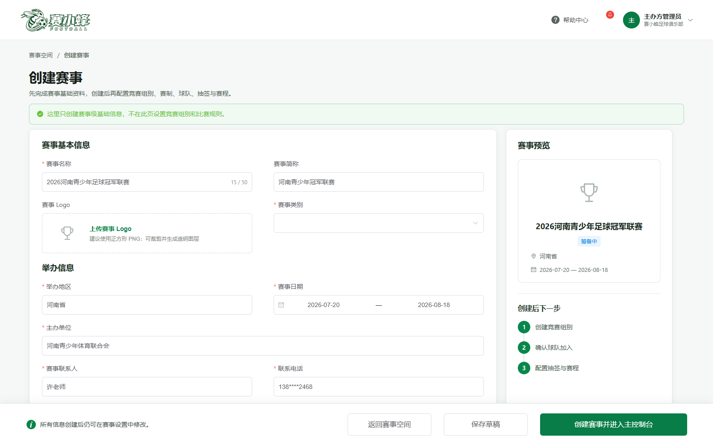
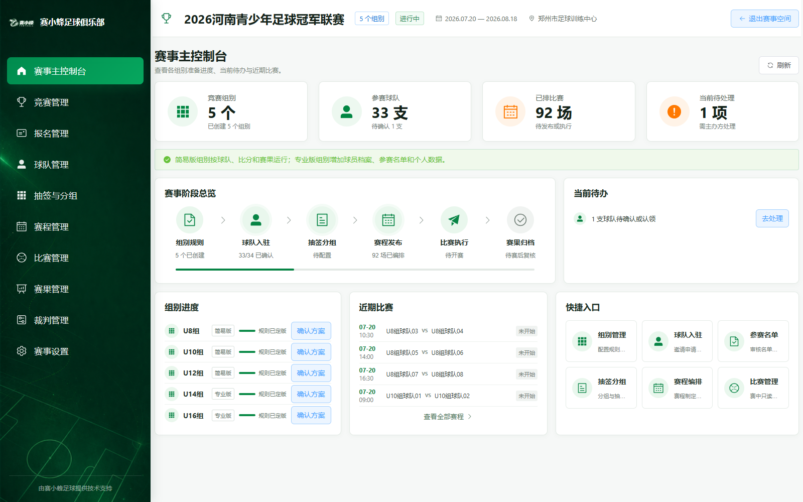
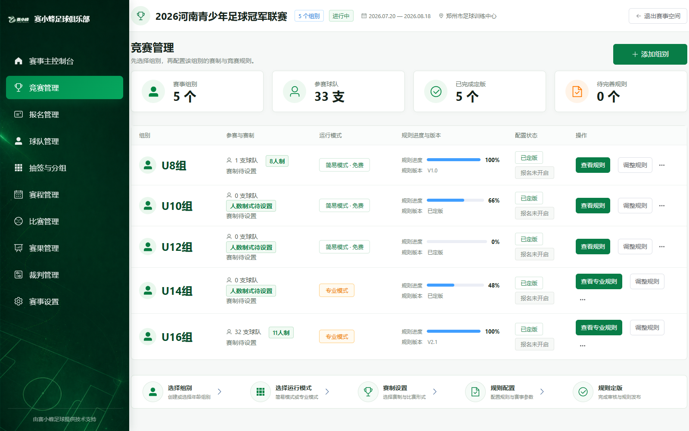
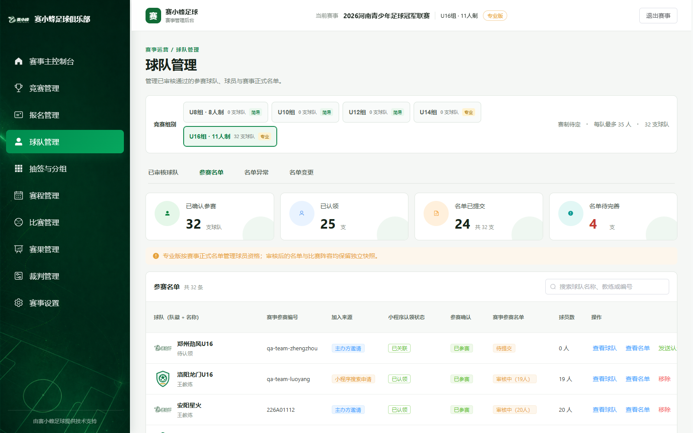
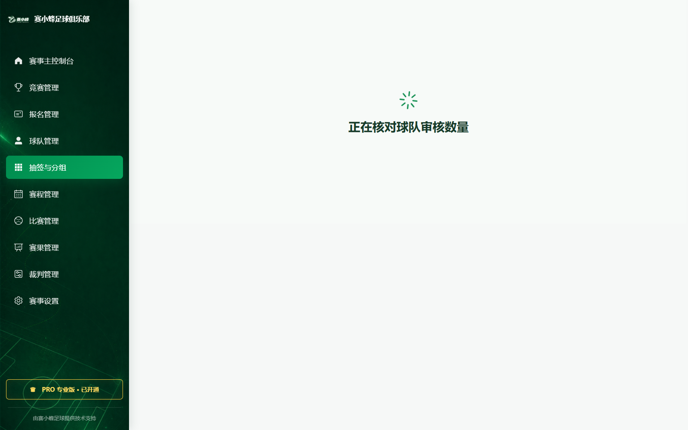
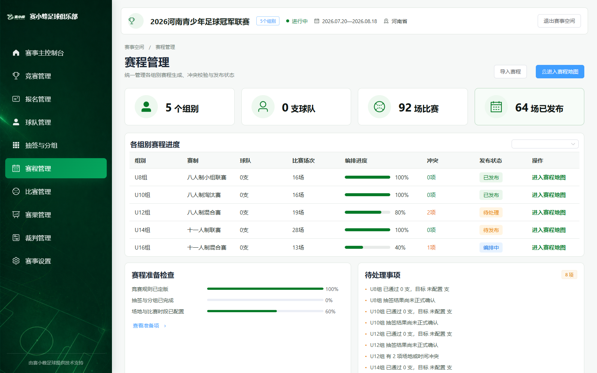
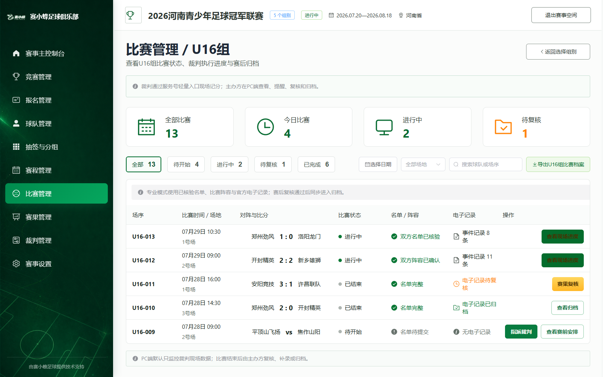
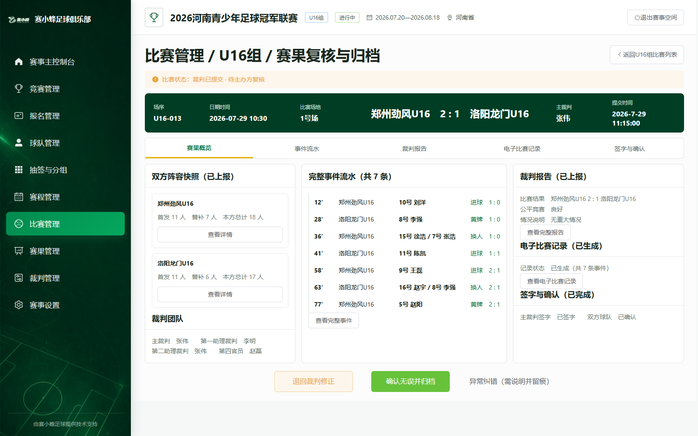

# 从创建赛事到赛后归档：赛小蜂足球 PC 后台完整使用指南

> **公众号摘要**：第一次使用赛小蜂足球 PC 管理后台，不知道该从哪里开始？这份图文教程沿着主办方的真实工作顺序，带你走完创建赛事、设置组别、管理球队、抽签排赛、比赛复核和归档。

比赛还没开始，主办方最容易卡住的，往往不是某个按钮，而是操作顺序。

赛事刚创建，就急着排赛程；球队还没审核完，就开始抽签；比赛结束后只看比分，却忘了复核记录和归档——这些操作单独看都不复杂，顺序错了，后面就可能反复返工。

赛小蜂足球 PC 管理后台的主线可以记成一句话：

**建赛事 → 定组别 → 管球队 → 做抽签 → 排赛程 → 管比赛 → 审赛果。**

这篇文章按照这条主线，带主办方从登录走到赛后归档。

> **截图说明**：文中截图来自本地隔离演示环境，赛事、球队、球员、比分及联系方式均为演示数据，不代表线上真实信息。实际菜单会随账号权限、赛事版本和当前进度略有不同。

## 01 打开官网：右上角微信扫码登录

电脑浏览器打开：**www.sxffootball.cn/**

点击页面右上角“立即登录”，使用微信扫码登录。

## 02 进入赛事空间：一场赛事，一个工作空间

登录后会进入“赛事空间”。主办方能在这里看到当前机构名下的赛事，以及球队数量、比赛数量和赛程进度。

已有赛事，点击卡片右侧的“进入”；准备新办一场比赛，点击“创建新赛事”。

进入某场赛事后，报名、球队、抽签、赛程、比赛和裁判操作都只针对当前赛事。开始操作前，先确认自己有没有进错赛事空间。

## 03 创建赛事：这一页只填赛事级资料

创建赛事时，先填写整场赛事共用的信息：赛事名称、举办地区、比赛地点、开始日期、结束日期和报名截止时间。

U8、U10、U12 等竞赛组别不在这一页设置。信息没填完，可以先“保存草稿”；确认无误后，点击“创建赛事并进入主控制台”。

提交前再看三处：

- 比赛日期能否覆盖全部赛程；
- 报名截止时间是否早于比赛开始时间；
- 场地名称能否让球队和裁判一眼认出。

## 04 主控制台：不要急着跳到后面的功能

赛事创建完成后，会进入主控制台。左侧依次提供竞赛管理、报名管理、球队管理、抽签与分组、赛程管理、比赛管理、赛果管理、裁判管理和赛事设置。

第一次配置时，按赛事进度往下走。组别规则还没定版，抽签和排赛所需的球队数量、赛制结构就没有可靠依据。页面上某一步尚未完成时，不建议为了赶进度直接跳过。

## 05 竞赛管理：先分清“竞赛组别”和“抽签小组”

进入“竞赛管理”，添加 U8、U10、U12 等竞赛组别。每个组别分别设置运行模式、比赛人数、赛制、积分排名和晋级规则。

后台里有两个很容易叫混的名称：

> **竞赛组别**：U8、U10、U12 等参赛单元。  
> **抽签小组**：抽签后产生的 A 组、B 组。

一个竞赛组别可以再分成多个抽签小组，但 A 组、B 组不能替代 U8、U10。

简易模式适合流程相对固定、资料要求较轻的赛事；专业模式包含更完整的资格、名单、比赛执行和归档流程。规则生效前逐项核对，生效后再让球队进入正式报名和名单流程。

## 06 球队管理：日常球队资料，不等于本届参赛名单

进入“球队管理”，选择竞赛组别后，可以处理球队邀请、报名审核、负责人认领和参赛名单。专业模式下，还要查看名单异常、资料补充和名单变更记录。

**球队资料是俱乐部长期维护的资产；参赛名单是球队参加某场赛事、某个组别时提交的快照。**

球队平时修改队徽、教练或球员资料，不会直接覆盖已经审核或已经完赛的历史名单。遇到同名球队、负责人冲突或资料异常时，应进入人工核验，不要自行合并。

## 07 抽签与分组：确认球队后再动手

参赛球队数量和资格确认后，进入“抽签与分组”。选择竞赛组别和运行模式，依次完成球队池、抽签设置、抽签操作与结果确认。

确认结果前，检查每支球队是否只出现一次、各组数量是否符合规则、种子队和回避条件是否落实。分组结果确认后，再进入赛程编排。

## 08 赛程管理：系统生成后，人工还要检查

进入“赛程管理”，选择竞赛组别，配置场地、日期、时间段和轮次。生成赛程后，先看总览，再处理冲突和需要手动调整的场次。

发布前至少检查四项：

- 同一球队有没有时间重叠；
- 两场比赛之间有没有合理休息时间；
- 同一场地有没有重复占用；
- 比赛时间有没有超出赛事日期范围。

手动调整一场比赛后，还要重新检查相关球队和相邻场次，不能只看被修改的那一行。

## 09 比赛日：PC 端重点看进度和待办

比赛开始后，进入“比赛管理”，按竞赛组别查看场序、时间、场地、对阵、比分、裁判执行进度和赛后状态。

裁判通过轻量入口记录现场情况，主办方在 PC 端查看进度、处理提醒和赛后待办。裁判已经提交的原始记录，不应被随意改写。

## 10 赛果复核：比分对了，还不算结束

裁判提交记录后，主办方需要核对最终比分、事件流水、双方阵容快照、裁判报告、电子比赛记录和签字状态。

发现问题，选择退回修正并写清原因；确认无误，再点击“确认无误并归档”。归档后的现场快照和电子记录转为只读，后续纠错需要说明原因并留下审计记录。

## 收藏这份主办方操作清单

- [ ] 微信扫码登录并完成手机号核验
- [ ] 创建赛事，核对日期、地点和报名截止时间
- [ ] 创建竞赛组别并定版规则
- [ ] 邀请球队，完成报名和名单审核
- [ ] 完成抽签并确认分组结果
- [ ] 生成赛程，排查球队、场地和时间冲突
- [ ] 比赛日查看裁判执行与比赛状态
- [ ] 赛后核对比分、事件、名单、报告和签字
- [ ] 确认无误后归档

涉及批量审核、赛程发布、退回修正和比赛归档时，确认前多看一眼赛事名称、竞赛组别和影响范围。后台能帮主办方把流程串起来，最终确认仍要由了解现场的人完成。

---

**官网入口：** www.sxffootball.cn/  
**适用对象：** 赛事主办方、赛事管理员

