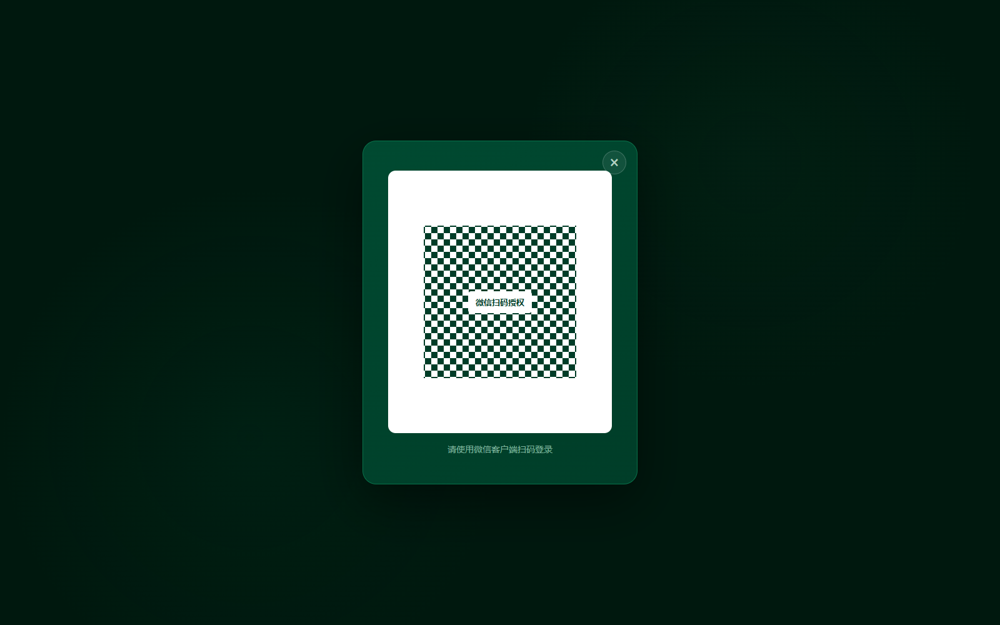

# 赛小蜂足球 PC 管理后台图文教程

> 适用对象：赛事主办方、赛事管理员。  
> 登录地址：[www.sxffootball.cn/admin/](https://www.sxffootball.cn/admin/)  
> 本文截图来自赛小蜂足球本地隔离演示环境。赛事、球队、球员、比分和联系方式均为演示数据，不代表线上真实信息；实际页面会随账号权限、赛事版本和当前进度略有不同。

办一场足球赛，后台操作不是从“排赛程”开始。正确顺序是：先创建赛事，再确定竞赛组别和规则，随后处理球队与名单，完成抽签后才能排赛程。比赛开始后，主办方在 PC 端查看进度，赛后复核裁判提交的记录并归档。

这篇教程沿着这条主线走一遍。第一次使用时，建议在电脑旁准备好赛事名称、比赛日期、举办地点、竞赛组别和预计球队数量。

## 一、登录 PC 管理后台

打开后台登录地址后，使用微信扫描页面二维码。首次登录或系统要求重新核验时，按页面提示完成手机号验证。

手机号用于确认自然人账号；微信只是登录渠道。同一位管理员更换电脑或登录方式时，仍应使用原账号绑定的手机号，不要临时创建多个账号。

## 二、从“赛事空间”进入工作

登录后首先看到赛事空间。这里列出当前机构可管理的赛事，并显示球队数量、比赛数量和赛程进度。

已有赛事时，点击赛事卡片右侧的“进入”；新办赛事时，点击“创建新赛事”。进入某场赛事后，报名、球队、抽签、赛程、比赛和裁判操作都只针对这场赛事。

## 三、创建赛事：先填赛事级资料

创建页只填写整场赛事共用的基础信息，例如赛事名称、举办地区、比赛地点、开始日期、结束日期和报名截止时间。

这里不要填写 U8、U10、U12 等组别规则。确认信息后，可以先“保存草稿”，也可以点击“创建赛事并进入主控制台”。

提交前重点检查三处：

- 比赛日期是否覆盖全部赛程；
- 报名截止日期是否早于比赛开始日期；
- 场地名称是否方便球队和裁判识别。

## 四、主控制台：按赛事进度进入功能

赛事创建完成后，会进入主控制台。左侧是赛事运行所需的主要功能：竞赛管理、报名管理、球队管理、抽签与分组、赛程管理、比赛管理、赛果管理、裁判管理和赛事设置。

第一次配置赛事时，建议按页面状态从左到右推进。某一步尚未完成时，不要为了赶进度直接跳到后面的功能。例如，组别规则没有定版，后续抽签和排赛所需的球队数量、赛制结构就没有可靠依据。

## 五、设置竞赛组别和比赛规则

进入“竞赛管理”，为赛事添加 U8、U10、U12 等竞赛组别。每个组别分别设置运行模式、比赛人数、赛制、积分排名和晋级规则。

这里最容易混淆两个概念：

- **竞赛组别**是 U8、U10、U12 等参赛单元；
- **抽签小组**是抽签后产生的 A 组、B 组。

两者不能混用。一个竞赛组别可以在抽签阶段再分成多个抽签小组。

简易模式适合流程相对固定、资料要求较轻的赛事；专业模式包含更完整的资格、名单、比赛执行和归档流程。规则定版前逐项核对，生效后再让球队进入正式报名和名单流程。

## 六、管理球队与正式参赛名单

进入“球队管理”，先选择竞赛组别，再处理球队邀请、报名审核、负责人认领和参赛名单。专业模式下，还要关注名单异常、资料补充和名单变更记录。

球队资料与参赛名单不是同一份数据：

- 球队资料是俱乐部长期维护的资产；
- 参赛名单是某支球队参加某场赛事、某个竞赛组别时提交的快照。

球队平时修改队徽、教练或球员资料，不会自动覆盖已经审核或已经完赛的历史名单。遇到同名球队、负责人冲突或资料异常时，应走人工核验，不要自行合并。

## 七、抽签与分组

球队数量和资格确认后，进入“抽签与分组”。选择对应竞赛组别和运行模式，完成球队池、抽签设置、操作过程与结果确认。

确认前检查：每支球队是否只出现一次、各组数量是否符合规则、种子队和回避条件是否落实。确认分组结果后，再进入赛程编排。不要用 A 组、B 组替代 U8、U10 等竞赛组别名称。

## 八、生成并检查赛程

进入“赛程管理”，先选择竞赛组别，再配置场地、日期、时间段和轮次。系统生成赛程后，先看总览，再处理冲突和需要手动调整的场次。

发布前至少检查四项：

- 同一球队是否出现时间重叠；
- 两场比赛之间是否留出合理休息时间；
- 同一场地是否被重复占用；
- 比赛时间是否落在赛事日期范围内。

如果修改单场时间或场地，应重新检查相关球队和相邻场次，不要只看被修改的那一行。

## 九、比赛日：PC 端负责查看、提醒和复核

比赛开始后，进入“比赛管理”，按竞赛组别查看场序、比赛时间、场地、对阵、比分、裁判执行进度和赛后状态。

裁判通过轻量入口完成现场记录，PC 端默认承担监控与管理职责。主办方可以查看比赛进度、处理赛后待办，但不应随意改写裁判已经提交的原始记录。

## 十、复核赛果并归档

裁判提交比赛记录后，主办方进入赛果复核页，核对最终比分、事件流水、双方阵容快照、裁判报告、电子比赛记录和签字状态。

资料有误时，选择退回修正并写清原因；确认无误后，再执行“确认无误并归档”。归档后的现场快照和电子记录转为只读，后续纠错需要说明原因并保留审计记录。

## 常见问题

### 1. 为什么不能直接开始排赛程？

赛程依赖竞赛组别、赛制、参赛球队和抽签结果。前面的条件没有确认，后面生成的场次就可能需要整批重做。

### 2. 球队改名后，已经结束的比赛会跟着变化吗？

不会用日常球队资料直接覆盖已审核名单和已完赛记录。历史赛事保存的是当时的参赛快照。

### 3. A 组是不是竞赛组别？

不是。U8、U10 是竞赛组别；A 组、B 组是抽签小组。

### 4. 裁判提交错了怎么办？

在赛果复核页退回修正，并填写具体原因。系统需要保留修改前后的记录，不能绕过复核直接覆盖。

### 5. 为什么我看到的菜单与截图不同？

页面会根据当前账号权限、赛事版本和赛事进度显示不同入口。先确认自己进入了正确的机构和赛事空间；仍有问题时，记录赛事名称、所在页面和提示文字，再联系平台协助处理。

## 一份可照着走的操作清单

- [ ] 使用微信扫码并完成手机号核验
- [ ] 创建赛事，检查日期、地点和报名截止时间
- [ ] 创建竞赛组别并定版规则
- [ ] 邀请球队，完成报名和名单审核
- [ ] 完成抽签并确认分组结果
- [ ] 生成赛程，处理球队、场地和时间冲突
- [ ] 比赛日查看裁判执行与比赛状态
- [ ] 赛后核对比分、事件、名单、报告和签字
- [ ] 确认无误后归档

完成以上步骤，一场赛事在 PC 管理后台中的主流程就闭环了。正式操作时，以页面当前状态和权限提示为准；涉及退回、归档、批量审核或赛程发布的动作，点击确认前再核对一次对象和影响范围。
